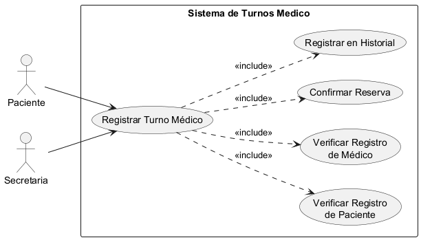
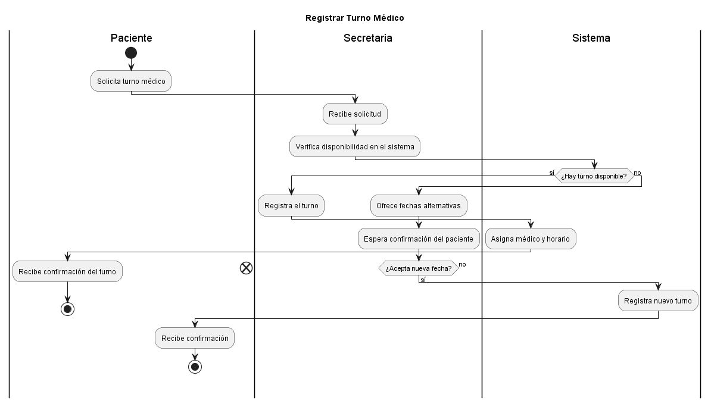
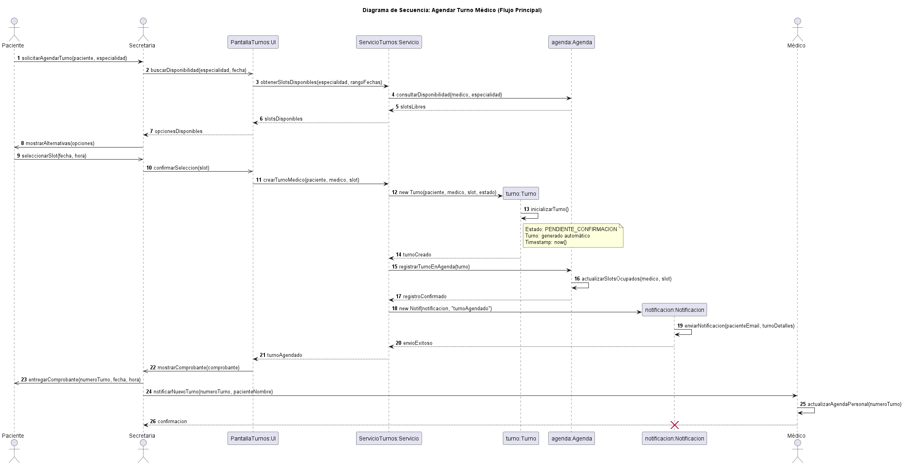
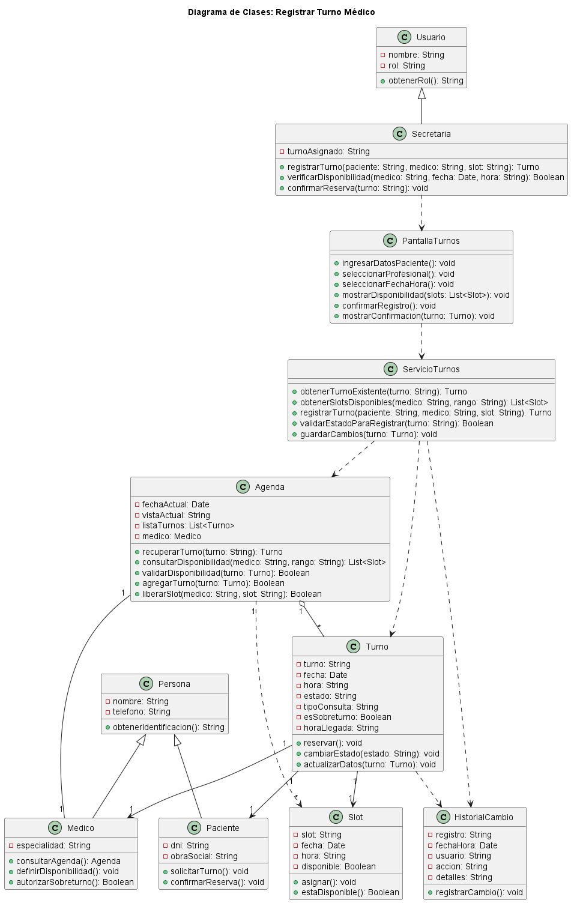

# Caso de Uso N° 1 - Registrar Turno Médico

---

## 1. Descripción y Trazabilidad con Requisitos Funcionales

Registra un turno médico entre un paciente y un profesional, asegurando que no haya superposición de horarios y que la agenda del médico esté disponible.

**Actor/es:** Paciente, Secretaria

**Objetivo:** Permitir el alta de un turno médico válido y almacenar su registro en el sistema.

**Flujo principal:**

1. El paciente solicita un turno.
2. La secretaria ingresa al sistema.
3. Se selecciona el paciente y el profesional.
4. Se selecciona fecha y hora.
5. El sistema valida disponibilidad en la agenda del médico.
6. Se registra el turno.
7. Se confirma el turno y se registra el cambio en el historial.

**Requisitos funcionales que satisface:**

| ID | Requisito Funcional (texto exacto de introduccion.md) | Cómo lo satisface este caso de uso |
|----|------------------------------------------------------|-------------------------------------|
| RF1 | Ciclo de vida del turno: El sistema debe permitir el alta, reprogramación y cancelación de turnos vinculados a un profesional y un paciente específico, gestionando los estados: Programado, Presente, Atendido, Cancelado y Ausente | Permite dar de alta un turno médico válido y establecer su estado inicial dentro del ciclo de vida. |
| RF2 | Validación de disponibilidad: El sistema debe impedir automáticamente la superposición horaria para un mismo profesional, permitiendo únicamente la carga manual de hasta dos (2) sobreturnos autorizados. | Valida la disponibilidad del horario antes de registrar el turno y evita la superposición en la agenda del médico. |

---

## 2. Diagrama de Casos de Uso



**Actores y relaciones:**
- **Paciente** → Actor principal que inicia la solicitud de turno.
- **Secretaria** → Actor que gestiona el registro del turno.
- **Include** `Verificar Registro de Paciente` y `Verificar Registro de Médico` → Incluidos para garantizar que ambos estén dados de alta.
- **Include** `Confirmar Reserva` → Incluido para cerrar el ciclo de registro y confirmar el turno.

---

## 3. Diagrama de Actividades



**Swimlanes:**
- **Paciente:** Solicita el turno.
- **Secretaria:** Ingresa los datos del paciente y profesional y selecciona el horario.
- **Sistema:** Consulta la agenda, valida disponibilidad, registra el turno y confirma la reserva.

**Decisiones clave del flujo:**
- *¿El paciente y el médico están registrados?* → Si: continúa. No: informa error.
- *¿El horario está disponible?* → Si: registra el turno. No: ofrece alternativas o rechaza la operación.

---

## 4. Diagrama de Secuencia



**Participantes:**
- `Paciente`: Actor que solicita el turno.
- `Secretaria`: Actor que ingresa la reserva.
- `PantallaTurnos:UI`: Interfaz de usuario que captura los datos.
- `ServicioTurnos:Servicio`: Controlador que valida disponibilidad y orquesta el registro.
- `agenda:Agenda`: Objeto que gestiona los horarios disponibles del médico.
- `turno:Turno`: Entidad del turno que se crea y se registra.

**Mensajes relevantes:**
- `ingresarDatosPaciente()` → El paciente provee su información.
- `consultarDisponibilidad(medicoID, fecha, hora)` → Se verifica la disponibilidad del médico.
- `registrarTurno(pacienteID, medicoID, slotID)` → Se crea y guarda el turno.
- `mostrarConfirmacion(turno)` → Se presenta la confirmación al usuario.

---

## 5. Diagrama de Clases del Caso de Uso



**Clases involucradas:**

| Clase | Responsabilidad (según tarjeta CRC) | Tarjeta CRC |
|-------|-------------------------------------|-------------|
| Secretaria | Registrar un turno en la agenda del médico y verificar disponibilidad | [herramientas-agile/tarjetas-crc/07-tarjeta-crc-secretaria.md](../../herramientas-agile/tarjetas-crc/07-tarjeta-crc-secretaria.md) |
| Paciente | Solicitar y confirmar la reserva del turno | [herramientas-agile/tarjetas-crc/02-tarjeta-crc-paciente.md](../../herramientas-agile/tarjetas-crc/02-tarjeta-crc-paciente.md) |
| Medico | Definir disponibilidad y autorizar sobreturnos | [herramientas-agile/tarjetas-crc/03-tarjeta-crc-medico.md](../../herramientas-agile/tarjetas-crc/03-tarjeta-crc-medico.md) |
| Turno | Mantener datos de la reserva y transicionar su estado | [herramientas-agile/tarjetas-crc/04-tarjeta-crc-turno.md](../../herramientas-agile/tarjetas-crc/04-tarjeta-crc-turno.md) |
| Agenda | Gestionar disponibilidad y agregar el turno al calendario del médico | [herramientas-agile/tarjetas-crc/05-tarjeta-crc-agenda.md](../../herramientas-agile/tarjetas-crc/05-tarjeta-crc-agenda.md) |
| HistorialCambio | Registrar de forma inalterable el alta del turno para auditoría | [herramientas-agile/tarjetas-crc/06-tarjeta-crc-historial.md](../../herramientas-agile/tarjetas-crc/06-tarjeta-crc-historial.md) |
| ServicioTurnos | Orquestar la lógica de negocio de reprogramación (controlador) | [herramientas-agile/tarjetas-crc/09-tarjeta-crc-servicio-turnos.md](../../herramientas-agile/tarjetas-crc/09-tarjeta-crc-servicio-turnos.md)
| PantallaTurnos | Capturar eventos de usuario y presentar alternativas (interfaz UI) |  [herramientas-agile/tarjetas-crc/10-tarjeta-crc-pantalla-turnos.md](../../herramientas-agile/tarjetas-crc/10-tarjeta-crc-pantalla-turnos.md) |

**Relaciones UML:**
- Herencia: `Persona` ← `Paciente`, `Medico`
- Herencia: `Usuario` ← `Secretaria`
- Composición: `Agenda` o-- `Turno`
- Asociación: `Turno` → `Paciente`, `Turno` → `Medico`
- Dependencia: `ServicioTurnos` ..> `Agenda`, `Turno`, `HistorialCambio`
- Dependencia: `PantallaTurnos` ..> `ServicioTurnos`

---

## 6. Pseudocódigo

```text
INICIO Registrar Turno Médico

LEER pacienteID desde UI
LEER medicoID desde UI
LEER fecha, hora desde UI

// Paso 1: Verificar registro de paciente y médico
SI pacienteID NO está registrado EN EL SISTEMA
    MOSTRAR "Paciente no registrado"
    RETORNAR FALSO
FIN SI

SI medicoID NO está registrado EN EL SISTEMA
    MOSTRAR "Médico no registrado"
    RETORNAR FALSO
FIN SI

// Paso 2: Verificar disponibilidad en la agenda del médico
slotsDisponibles ← ServicioTurnos.obtenerSlotsDisponibles(medicoID, fecha)
SI slotsDisponibles está VACÍO o hora NO está disponible
    MOSTRAR "Horario no disponible"
    RETORNAR FALSO
FIN SI

// Paso 3: Registrar el turno
turno ← ServicioTurnos.registrarTurno(pacienteID, medicoID, slotID)
SI turno es NULO
    MOSTRAR "Error al registrar el turno"
    RETORNAR FALSO
FIN SI

// Paso 4: Confirmar la reserva
ServicioTurnos.guardarCambios(turno)
PantallaTurnos.mostrarConfirmacion(turno)

MOSTRAR "Turno registrado exitosamente"
RETORNAR VERDADERO

FIN
```

**Trazabilidad del pseudocódigo:**
- Flujo principal (§1): sigue los pasos 1-7 detallados.
- Diagrama de actividades (§3): respeta las decisiones de verificación de registro y disponibilidad.
- Diagrama de secuencia (§4): cada mensaje corresponde a las interacciones definidas.
- Tarjetas CRC (§5): los métodos invocados coinciden con las responsabilidades de cada clase.
