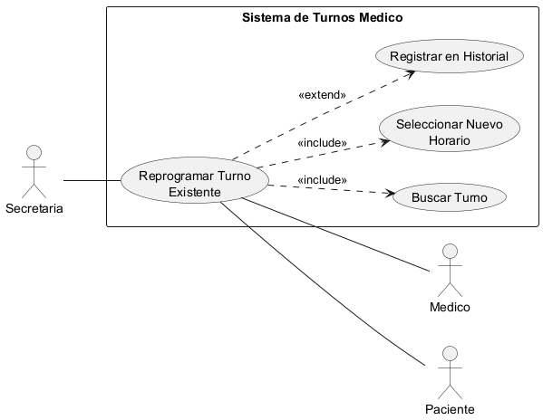
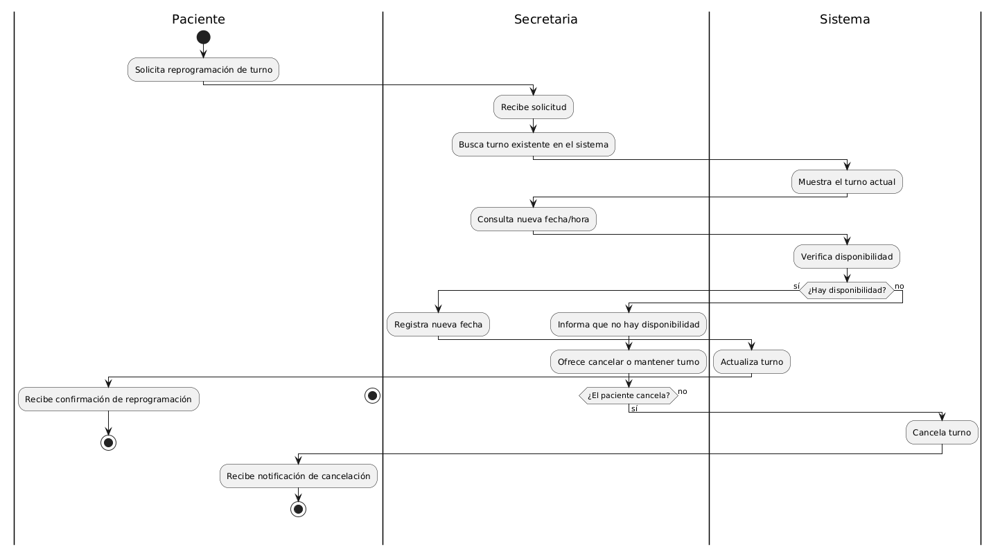
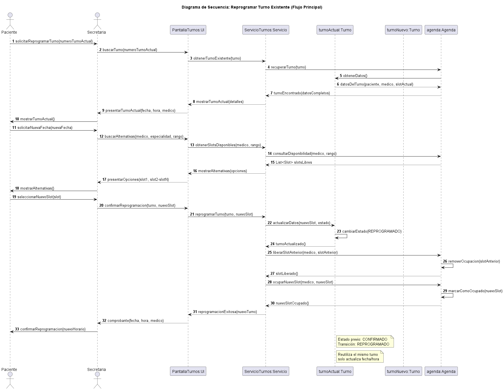
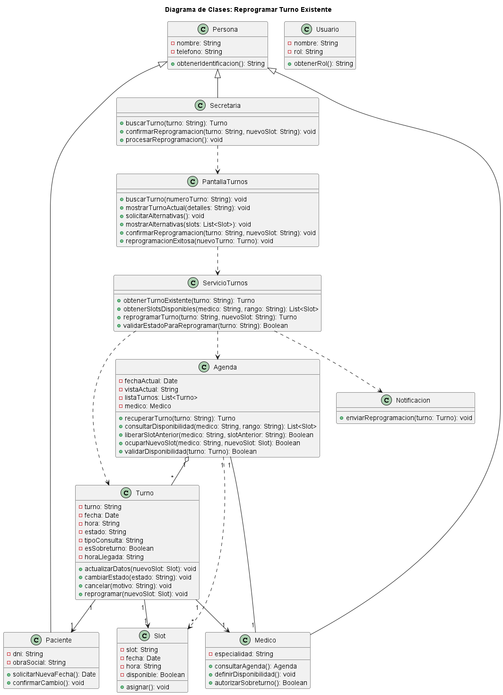

# Caso de Uso N° 2 - Reprogramar Turno Existente

---

## 1. Descripción y Trazabilidad con Requisitos Funcionales

Cambia la fecha o el horario de una cita ya pactada a solicitud del médico o paciente.

**Actor/es:** Secretaria

**Objetivo:** Permite modificar la fecha y hora de un turno existente

**Flujo principal:**

1. Se busca el turno
2. Se selecciona reprogramar
3. Se elige nueva fecha
4. Sistema valida disponibilidad
5. Se actualiza el turno

**Requisitos funcionales que satisface:**

| ID | Requisito Funcional (texto exacto de introduccion.md) | Cómo lo satisface este caso de uso |
|----|------------------------------------------------------|-------------------------------------|
| RF1 | Ciclo de vida del turno: El sistema debe permitir el alta, reprogramación y cancelación de turnos vinculados a un profesional y un paciente específico, gestionando los estados: Programado, Presente, Atendido, Cancelado y Ausente | Permite cambiar la fecha/hora de un turno existente, actualizando su estado dentro del ciclo de vida |
| RF2 | Validación de disponibilidad: El sistema debe impedir automáticamente la superposición horaria para un mismo profesional, permitiendo únicamente la carga manual de hasta dos (2) sobreturnos autorizados. | Valida que la nueva fecha no genere conflictos horarios con otros turnos del mismo profesional |

---

## 2. Diagrama de Casos de Uso



**Actores y relaciones:**
- **Secretaria** → Actor principal que ejecuta la reprogramación a solicitud del paciente/médico
- **Paciente** → Actor afectado que recibe la confirmación del cambio
- **Médico** → Actor afectado cuya agenda se modifica
- **Include** `Buscar Turno`: Se incluye siempre para localizar el turno a reprogramar
- **Include** `Seleccionar Nuevo Horario`: Se incluye para elegir la nueva fecha/hora entre opciones disponibles
- **Extend** `Registrar en Historial`: Se extiende para auditar el cambio según RF5

---

## 3. Diagrama de Actividades



**Swimlanes:** 
- **Paciente**: Solicita la reprogramación y recibe confirmación
- **Secretaria**: Recibe solicitud, busca el turno, consulta disponibilidad, registra nueva fecha
- **Sistema**: Verifica disponibilidad en Agenda, actualiza el turno, confirma cambio
- **Agenda**: Valida horarios, libera slot anterior, ocupa nuevo slot

**Decisiones clave del flujo:** 
- *¿Hay disponibilidad?* → Si: continúa reprogramación. No: ofrece cancelar o mantener turno
- *¿El paciente acepta cancelar?* → Si: procede a cancelación. No: finaliza sin cambios

---

## 4. Diagrama de Secuencia



**Participantes:** 
- `Paciente`: Actor que inicia la solicitud
- `Secretaria`: Actor que gestiona la operación
- `PantallaTurnos:UI`: Interfaz de usuario (objeto de clase PantallaTurnos)
- `ServicioTurnos:Servicio`: Controlador que orquesta la lógica (objeto de clase ServicioTurnos)
- `turnoActual:Turno`: Instancia del turno a modificar
- `turnoNuevo:Turno`: Referencia reutilizada del mismo turno (sin crear nueva instancia)
- `agenda:Agenda`: Objeto que gestiona disponibilidad

**Mensajes relevantes:**
- Pasos 1-8: Búsqueda y recuperación del turno existente
- Pasos 9-19: Consulta de slots disponibles y presentación de alternativas
- Pasos 20-28: Confirmación, actualización de datos, cambio de estado a REPROGRAMADO
- Pasos 29-33: Liberación del slot anterior y ocupación del nuevo en la agenda

**Objetos y su ciclo de vida:**
- `turnoActual` y `turnoNuevo` referencian el mismo objeto; se evita duplicación
- Todos los objetos persisten durante todo el flujo; no hay destrucciones temporales

**Mensajes clave:**
- `obtenerTurnoExistente(turnoID)` → Recupera el turno a reprogramar
- `obtenerSlotsDisponibles(medicID, rango)` → Consulta horarios libres del médico
- `reprogramarTurno(turnoID, nuevoSlotID)` → Ejecuta la actualización del turno
- `liberarSlotAnterior(medicID, slotAnterior)` → Devuelve a disponible el horario anterior
- `ocuparNuevoSlot(medicID, nuevoSlot)` → Marca como ocupado el nuevo horario

**Objetos temporales destruidos:** Ninguno. Todos los objetos persisten durante el flujo porque representan entidades del dominio (Turno, Agenda, Medico) que deben mantenerse en estado consistente.

---

## 5. Diagrama de Clases del Caso de Uso



**Clases involucradas:**

| Clase | Responsabilidad (según tarjeta CRC) | Tarjeta CRC |
|-------|-------------------------------------|-------------|
| Usuario | Representar a un usuario del sistema con permisos para gestionar turnos | [herramientas-agile/tarjetas-crc/12-tarjeta-crc-usuario.md](../../herramientas-agile/tarjetas-crc/12-tarjeta-crc-usuario.md) |
| Persona | Compartir datos personales comunes entre paciente, médico y secretaria | [herramientas-agile/tarjetas-crc/01-tarjeta-crc-persona.md](../../herramientas-agile/tarjetas-crc/01-tarjeta-crc-persona.md) |
| Slot | Representar el horario disponible reservado por un turno | [herramientas-agile/tarjetas-crc/13-tarjeta-crc-slot.md](../../herramientas-agile/tarjetas-crc/13-tarjeta-crc-slot.md) |
| Secretaria | Reprogramar turnos modificando la agenda existente | [herramientas-agile/tarjetas-crc/07-tarjeta-crc-secretaria.md](../../herramientas-agile/tarjetas-crc/07-tarjeta-crc-secretaria.md) |
| Paciente | Solicitar reprogramación y confirmación de cambio | [herramientas-agile/tarjetas-crc/02-tarjeta-crc-paciente.md](../../herramientas-agile/tarjetas-crc/02-tarjeta-crc-paciente.md) |
| Medico | Autorizar sobreturnos y proporcionar disponibilidad | [herramientas-agile/tarjetas-crc/03-tarjeta-crc-medico.md](../../herramientas-agile/tarjetas-crc/03-tarjeta-crc-medico.md) |
| Turno | Cambiar estado del turno y permitir reprogramación | [herramientas-agile/tarjetas-crc/04-tarjeta-crc-turno.md](../../herramientas-agile/tarjetas-crc/04-tarjeta-crc-turno.md) |
| Agenda | Validar disponibilidad y gestionar sobreturnos autorizados | [herramientas-agile/tarjetas-crc/05-tarjeta-crc-agenda.md](../../herramientas-agile/tarjetas-crc/05-tarjeta-crc-agenda.md) |
| ServicioTurnos | Orquestar la lógica de negocio de reprogramación (controlador) | [herramientas-agile/tarjetas-crc/09-tarjeta-crc-servicio-turnos.md](../../herramientas-agile/tarjetas-crc/09-tarjeta-crc-servicio-turnos.md)
| PantallaTurnos | Capturar eventos de usuario y presentar alternativas (interfaz UI) |  [herramientas-agile/tarjetas-crc/10-tarjeta-crc-pantalla-turnos.md](../../herramientas-agile/tarjetas-crc/10-tarjeta-crc-pantalla-turnos.md) |
**Relaciones UML:**

| Relación | Clases | Justificación |
|----------|--------|---------------|
| Herencia | Persona ← Paciente, Medico | Los actores humanos comparten atributos comunes (nombre, teléfono) |
| Herencia | Usuario ← Secretaria | La Secretaria es un Usuario autenticado en el sistema |
| Composición | Agenda ← Medico | La Agenda pertenece exclusivamente a un Médico; no puede existir sin él |
| Agregación | Agenda ◇— Turno | La Agenda contiene múltiples Turnos pero estos pueden existir independientemente |
| Asociación | Turno → Paciente | Un Turno está ligado a un Paciente específico |
| Asociación | Turno → Medico | Un Turno está ligado a un Médico específico |
| Dependencia | ServicioTurnos ···> Agenda | El servicio depende de Agenda para validar disponibilidad |
| Dependencia | ServicioTurnos ···> Turno | El servicio depende de Turno para modificar datos |
| Dependencia | PantallaTurnos ···> ServicioTurnos | La UI depende del servicio para la lógica de negocio |

---

## 6. Pseudocódigo

```text
INICIO Reprogramar Turno Existente

// Se crean o recuperan los objetos que participan en el caso de uso
pantalla ← PantallaTurnos
servicio ← ServicioTurnos

// La secretaria busca el turno que desea reprogramar desde la pantalla
pantalla.buscarTurno(numeroTurno)

// Se recupera el turno solicitado
turno ← servicio.obtenerTurnoExistente(turno)

SI turno ES NULO
    pantalla.mostrarError("Turno no encontrado")
    FIN
FIN SI

// Se muestran los datos del turno actual para verificarlos
pantalla.mostrarTurnoActual(detalles)

// La secretaria solicita consultar horarios alternativos
pantalla.solicitarAlternativas()

// Se obtienen los horarios disponibles para el profesional
slots ← servicio.obtenerSlotsDisponibles(medico, rango)

SI slots ESTÁ VACÍO
    pantalla.mostrarError("No hay horarios disponibles")
    FIN
FIN SI

// La pantalla muestra las alternativas disponibles para seleccionar un nuevo horario
pantalla.mostrarAlternativas(slots)

// Se confirma la reprogramación utilizando el horario seleccionado
pantalla.confirmarReprogramacion(turno, nuevoSlot)

// El servicio actualiza el turno con el nuevo horario
turnoReprogramado ← servicio.reprogramarTurno(turno, nuevoSlot)

// Se informa que la reprogramación fue realizada correctamente
pantalla.reprogramacionExitosa(turnoReprogramado)

FIN
```

```text
IMPLEMENTACIÓN DE DOMINIO: ServicioTurnos.reprogramarTurno(turno, nuevoSlot)

turno ← servicio.obtenerTurnoExistente(turno)

SI turno ES NULO
    RETORNAR ERROR("Turno inexistente")
FIN SI

SI turno.estado NO ESTÁ EN ["Programado"]
    RETORNAR ERROR("Estado del turno no permite reprogramación")
FIN SI

éxitoOcupar ← Agenda.ocuparNuevoSlot(turno.medico, nuevoSlot)

SI NO éxitoOcupar
    RETORNAR ERROR("Conflicto de agenda: slot ya reservado o regla de sobreturno violada")
FIN SI

Agenda.liberarSlotAnterior(turno.medico, turno.slot)
turno.actualizarSlot(nuevoSlot)
turno.cambiarEstado("REPROGRAMADO")
servicio.registrarHistorialCambio(turno, evento="Reprogramación", realizadoPor="Secretaria")
servicio.persistir(turno)
servicio.emitirEventoReprogramacion(turno)

RETORNAR OK
```

**Trazabilidad del pseudocódigo:**
- Flujo principal (§1): Se ejecutan los 5 pasos exactamente en el mismo orden
- Diagrama de actividades (§3): Las decisiones se validan antes de cada operación
- Diagrama de secuencia (§4): Cada línea corresponde a un mensaje intercambiado en el diagrama
- Tarjetas CRC (§5): Los métodos invocados coinciden con responsabilidades de cada clase