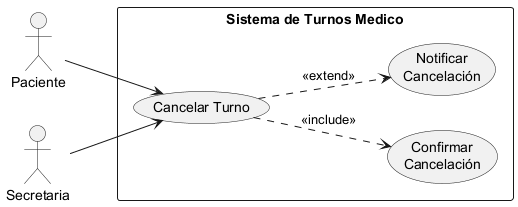
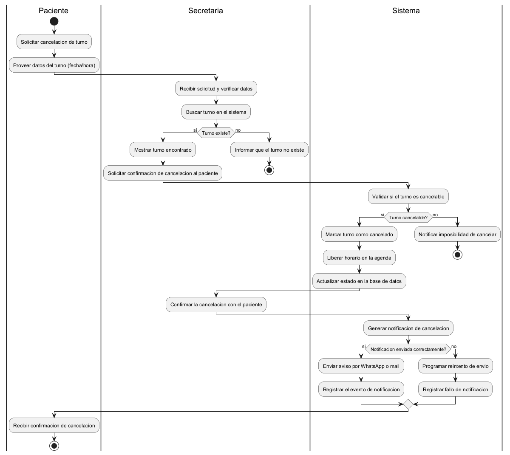
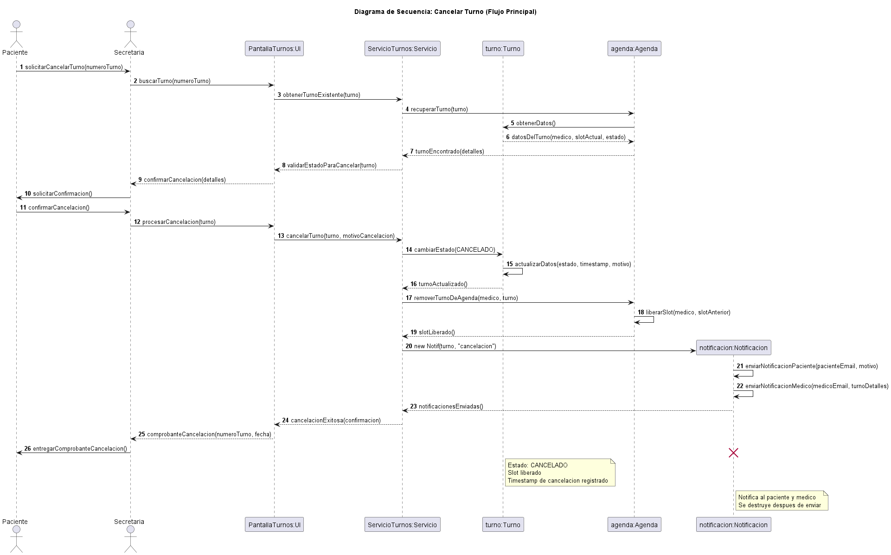
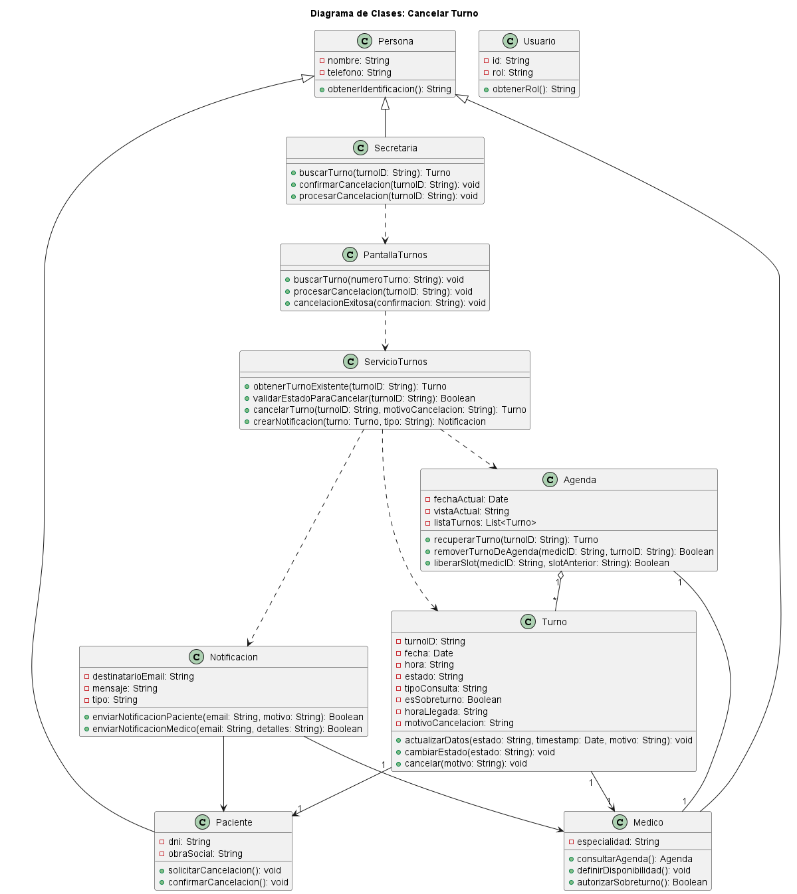

# Caso de Uso N° 3 - Cancelar Turno

---

## 1. Descripción y Trazabilidad con Requisitos Funcionales

Anula una reserva de turno liberando el espacio en la agenda médica.

**Actor/es:** Paciente, Secretaria

**Objetivo:** Permite cancelar un turno existente

**Flujo principal:**

1. Se busca el turno
2. Se selecciona cancelar
3. Se confirma acción
4. Sistema cambia estado
5. Se libera horario
6. El sistema notifica al paciente la cancelación

**Requisitos funcionales que satisface:**

| ID | Requisito Funcional (texto exacto de introduccion.md) | Cómo lo satisface este caso de uso |
|----|------------------------------------------------------|-------------------------------------|
| RF1 | Ciclo de vida del turno: El sistema debe permitir el alta, reprogramación y cancelación de turnos vinculados a un profesional y un paciente específico, gestionando los estados: Programado, Presente, Atendido, Cancelado y Ausente | Permite cambiar el estado de un turno a CANCELADO, completando el ciclo de vida del turno |
| RF2 | Validación de disponibilidad: El sistema debe impedir automáticamente la superposición horaria para un mismo profesional, permitiendo únicamente la carga manual de hasta dos (2) sobreturnos autorizados. | Libera el slot ocupado, restaurando la disponibilidad para otras reservas y eliminando conflictos |

---

## 2. Diagrama de Casos de Uso



**Actores y relaciones:**
- **Paciente** → Actor principal que inicia la solicitud de cancelación
- **Secretaria** → Actor que recibe la solicitud y procesa la cancelación
- **Include** `Confirmar Cancelación`: Se incluye siempre para validar la acción antes de ejecutarla
- **Include** `Notificar Cancelación`: Se incluye siempre para comunicar al paciente y al médico del cambio

---

## 3. Diagrama de Actividades



**Swimlanes:** 
- **Paciente**: Solicita cancelación y proporciona datos del turno
- **Secretaria**: Recibe solicitud, verifica el turno, solicita confirmación
- **Sistema**: Valida si el turno es cancelable, marca como cancelado, libera horario, genera notificación
- **Agenda**: Se actualiza quitando el turno ocupado

**Decisiones clave del flujo:** 
- *¿Turno existe?* → Si: continúa. No: informa que no existe y finaliza
- *¿Turno cancelable?* → Si: procede. No: notifica imposibilidad de cancelar
- *¿Notificación enviada correctamente?* → Si: registra éxito. No: programa reintento

---

## 4. Diagrama de Secuencia



**Participantes:** 
- `Paciente`: Actor que inicia la solicitud de cancelación
- `Secretaria`: Actor que gestiona la operación
- `PantallaTurnos:UI`: Interfaz de usuario (objeto de clase PantallaTurnos)
- `ServicioTurnos:Servicio`: Controlador que orquesta la lógica (objeto de clase ServicioTurnos)
- `turno:Turno`: Instancia del turno a cancelar
- `agenda:Agenda`: Objeto que gestiona disponibilidad
- `notificacion:Notificacion`: Objeto temporal que envía notificaciones

**Mensajes relevantes:**
- Pasos 1-10: Búsqueda y validación del turno para cancelar
- Pasos 11-13: Solicitud de confirmación al paciente
- Pasos 14-19: Cambio de estado del turno a CANCELADO y actualización de datos
- Pasos 20-23: Liberación del slot en la agenda
- Pasos 24-28: Creación y envío de notificaciones a paciente y médico
- Pasos 29-31: Confirmación de cancelación exitosa

**Objetos temporales:**
- `notificacion:Notificacion` es un objeto temporal que se crea (paso 24) y se destruye (paso final) tras completar el envío de notificaciones. Se usa el estereotipo `create` y `destroy` para indicar su ciclo de vida acotado

**Mensajes clave:**
- `obtenerTurnoExistente(turnoID)` → Recupera el turno a cancelar
- `validarEstadoParaCancelar(turnoID)` → Verifica si el turno puede ser cancelado
- `cancelarTurno(turnoID, motivoCancelacion)` → Ejecuta la cancelación
- `removerTurnoDeAgenda(medicID, turnoID)` → Elimina el turno de la agenda
- `liberarSlot(medicID, slotAnterior)` → Marca el horario como disponible
- `enviarNotificacionPaciente(email, motivo)` → Notifica al paciente
- `enviarNotificacionMedico(email, detalles)` → Notifica al médico

---

## 5. Diagrama de Clases del Caso de Uso



**Clases involucradas:**

| Clase | Responsabilidad (según tarjeta CRC) | Tarjeta CRC |
|-------|-------------------------------------|-------------|
| Paciente | Cancelar turno y recibir confirmación | [herramientas-agile/tarjetas-crc/02-tarjeta-crc-paciente.md](../../herramientas-agile/tarjetas-crc/02-tarjeta-crc-paciente.md) |
| Secretaria | Cancelar turnos y gestionar confirmaciones | [herramientas-agile/tarjetas-crc/07-tarjeta-crc-secretaria.md](../../herramientas-agile/tarjetas-crc/07-tarjeta-crc-secretaria.md) |
| Medico | Recibir notificación de cancelación | [herramientas-agile/tarjetas-crc/03-tarjeta-crc-medico.md](../../herramientas-agile/tarjetas-crc/03-tarjeta-crc-medico.md) |
| Turno | Cambiar estado a CANCELADO y permitir cancelación | [herramientas-agile/tarjetas-crc/04-tarjeta-crc-turno.md](../../herramientas-agile/tarjetas-crc/04-tarjeta-crc-turno.md) |
| Agenda | Validar cancelabilidad y liberar slot ocupado | [herramientas-agile/tarjetas-crc/05-tarjeta-crc-agenda.md](../../herramientas-agile/tarjetas-crc/05-tarjeta-crc-agenda.md) |
| Notificacion | Generar y enviar notificaciones de cancelación | Sin tarjeta CRC — Clase de entidad derivada del diagrama de secuencia |
| ServicioTurnos | Orquestar la lógica de negocio de cancelación (controlador) | Sin tarjeta CRC — Clase de control derivada del diagrama de secuencia |
| PantallaTurnos | Capturar eventos de usuario y presentar confirmaciones (interfaz UI) | Sin tarjeta CRC — Clase de interfaz derivada del diagrama de secuencia |

**Relaciones UML:**

| Relación | Clases | Justificación |
|----------|--------|---------------|
| Herencia | Persona ← Paciente, Medico | Los actores humanos comparten atributos comunes (nombre, teléfono) |
| Herencia | Usuario ← Secretaria | La Secretaria es un Usuario autenticado en el sistema |
| Composición | Agenda ← Medico | La Agenda pertenece exclusivamente a un Médico; no puede existir sin él |
| Agregación | Agenda ◇— Turno | La Agenda contiene múltiples Turnos pero estos pueden existir independientemente |
| Asociación | Turno → Paciente | Un Turno está ligado a un Paciente específico |
| Asociación | Turno → Medico | Un Turno está ligado a un Médico específico |
| Dependencia | ServicioTurnos ···> Agenda | El servicio depende de Agenda para liberar slots |
| Dependencia | ServicioTurnos ···> Turno | El servicio depende de Turno para cambiar estado |
| Dependencia | ServicioTurnos ···> Notificacion | El servicio crea instancias de Notificacion |
| Dependencia | Notificacion ···> Paciente | La Notificacion envía mensajes al Paciente |
| Dependencia | Notificacion ···> Medico | La Notificacion envía mensajes al Médico |
| Dependencia | PantallaTurnos ···> ServicioTurnos | La UI depende del servicio para la lógica de negocio |

---

## 6. Pseudocódigo

```text
INICIO Cancelar Turno

// Contexto: El Paciente o Secretaria solicita cancelar un turno existente.
// Se valida que el turno sea cancelable, se libera el horario y se notifica a ambas partes.

LEER numeroTurno desde UI

// Paso 1: Búsqueda y validación del turno existente
turno ← ServicioTurnos.obtenerTurnoExistente(numeroTurno)
SI turno es NULO
    MOSTRAR "Turno no encontrado"
    RETORNAR FALSO
FIN SI

// Paso 2: Validar que el turno pueda ser cancelado
esCancelable ← ServicioTurnos.validarEstadoParaCancelar(numeroTurno)
SI NO esCancelable
    MOSTRAR "Este turno no puede ser cancelado en su estado actual"
    RETORNAR FALSO
FIN SI

// Paso 3: Solicitar confirmación de cancelación
MOSTRAR "¿Confirma la cancelación del turno?" + detalles(turno)
confirmacion ← LEER respuesta del usuario

SI confirmacion = "SI"
    // Paso 4: Cambiar estado del turno a CANCELADO
    turno.cambiarEstado("CANCELADO")
    turno.actualizarDatos(estado="CANCELADO", timestamp=HORA_ACTUAL, motivo="Cancelado por usuario")
    
    // Paso 5: Liberar el horario ocupado en la agenda del médico
    medicID ← turno.medico.id
    slotID ← turno.horaID
    Agenda.removerTurnoDeAgenda(medicID, numeroTurno)
    Agenda.liberarSlot(medicID, slotID)
    
    // Paso 6: Notificar a paciente y médico sobre la cancelación
    INTENTAR
        notificacion ← ServicioTurnos.crearNotificacion(turno, tipo="CANCELACION")
        notificacion.enviarNotificacionPaciente(turno.paciente.email, turno.motivoCancelacion)
        notificacion.enviarNotificacionMedico(turno.medico.email, detalles(turno))
        
        // Registrar cancelación exitosa
        ServicioTurnos.guardarCambios(turno)
        MOSTRAR "Turno cancelado exitosamente"
        MOSTRAR Comprobante de cancelación
        
        RETORNAR VERDADERO
        
    EXCEPTO EN CASO DE ERROR EN NOTIFICACION
        MOSTRAR "Turno cancelado pero hubo error al notificar"
        PROGRAMAR reintento de notificacion
        RETORNAR VERDADERO
    FIN INTENTAR
    
SINO
    MOSTRAR "Cancelación abortada por el usuario"
    RETORNAR FALSO
FIN SI

FIN
```

**Trazabilidad del pseudocódigo:**
- Flujo principal (§1): Se ejecutan los 6 pasos exactamente en el mismo orden
- Diagrama de actividades (§3): Las decisiones de validación (existe, es cancelable) se validan antes de cada operación
- Diagrama de secuencia (§4): Cada línea corresponde a un mensaje intercambiado; el objeto `Notificacion` se crea y destruye en el flujo
- Tarjetas CRC (§5): Los métodos invocados coinciden con responsabilidades de cada clase
- Ciclo de vida del turno: El estado transiciona de CONFIRMADO → CANCELADO conforme a RF1