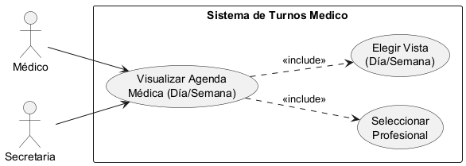
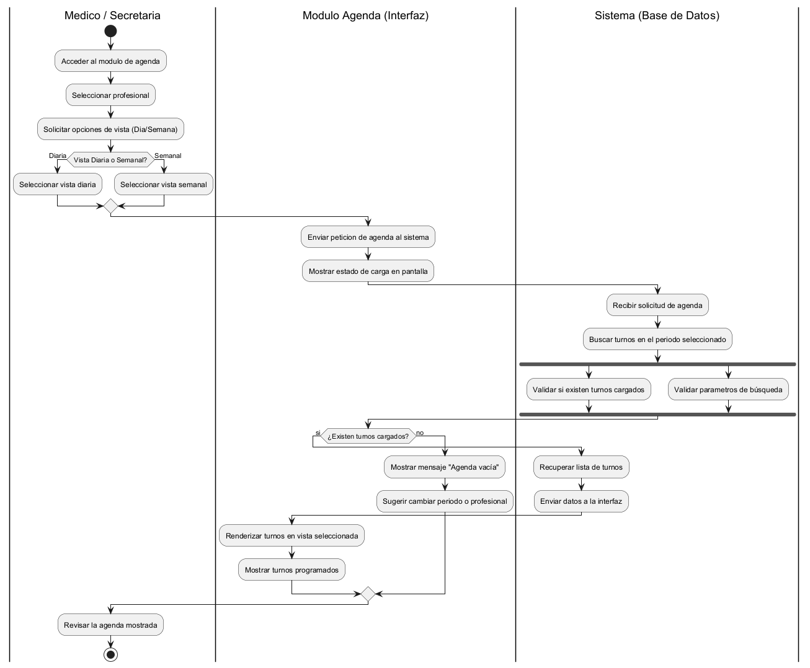
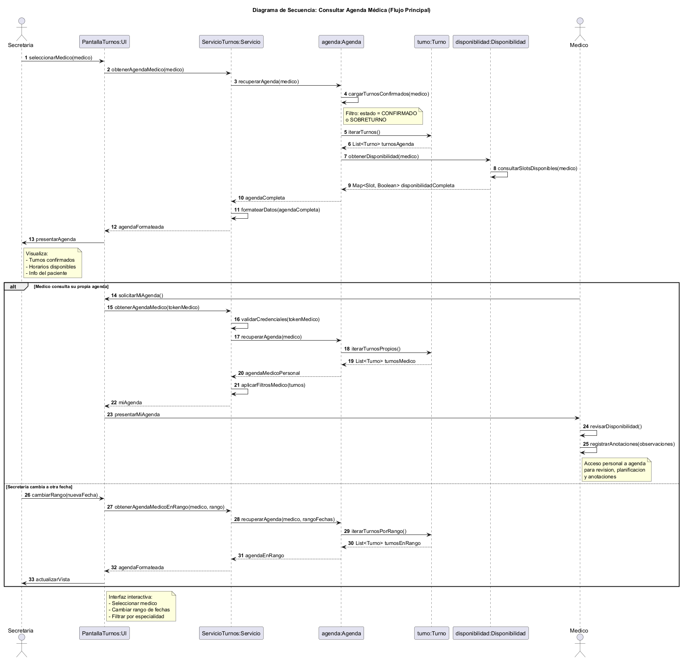
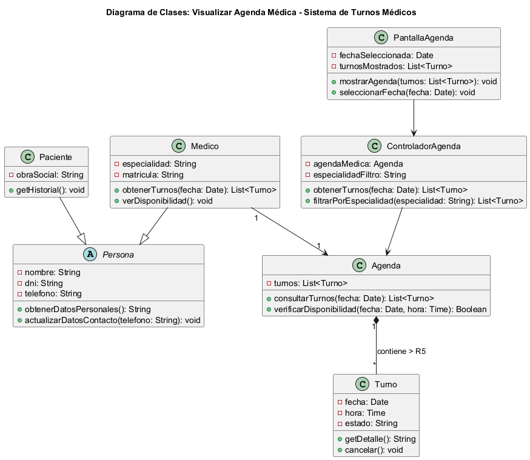

# Análisis Funcional - Caso de Uso 4: Visualizar Agenda Médica

## Descripción del caso de uso y trazabilidad con requisitos funcionales

**Actor:** Médico

**Flujo principal:**
1. El médico solicita ver su agenda para una fecha específica.
2. El sistema consulta los turnos asignados para esa fecha.
3. El sistema muestra los horarios ocupados y libres.

**Flujos alternativos:**
- Si no hay turnos, se muestra mensaje informativo.

**Trazabilidad con RFs (A1):**
- **RF4 (Visualización de agenda):** El caso de uso permite al médico consultar su agenda.

## Diagrama de casos de uso (A2)



### Actores y relaciones

| Actor | Rol en el caso de uso |
|-------|----------------------|
| **Médico** | Actor principal. Inicia el caso de uso para consultar su agenda. |
| **Sistema** | Actor secundario que procesa la consulta y devuelve los turnos. |

**Relaciones:**
- El Médico está **asociado** directamente al caso de uso "Visualizar Agenda Médica".
- No se utilizan relaciones `include` ni `extend` porque el flujo es directo y no depende de otros casos de uso.

## Diagrama de actividades (A3)



### Swimlanes y decisiones clave

**Swimlanes (carriles):**
| Carril | Actor/Componente | Responsabilidad |
|--------|------------------|-----------------|
| Médico | Médico | Inicia la solicitud de visualización de agenda |
| Sistema | Sistema | Procesa la consulta y devuelve los turnos |

**Decisiones clave del flujo:**
- **¿Hay turnos disponibles?** → Si hay turnos, los muestra. Si no, muestra un mensaje informativo.

## Diagrama de secuencia (A3)



### Participantes y mensajes clave

**Participantes:**
| Participante | Notación UML | Tipo |
|--------------|--------------|------|
| Médico | `actor` | Actor que inicia el caso de uso |
| PantallaAgenda | `participant` | Clase que muestra la agenda |
| ControladorAgenda | `participant` | Clase que orquesta la consulta |
| Agenda | `participant` | Clase que contiene los turnos |

**Mensajes clave:**
| Mensaje | Origen → Destino | Efecto |
|---------|------------------|--------|
| `consultarAgenda(fecha)` | Médico → PantallaAgenda | Inicia la consulta de agenda |
| `solicitarAgenda(fecha)` | PantallaAgenda → ControladorAgenda | Solicita la lista de turnos |
| `obtenerTurnos(fecha)` | ControladorAgenda → Agenda | Obtiene los turnos de la fecha |
| `mostrarTurnos` | ControladorAgenda → PantallaAgenda | Devuelve la lista para mostrar |

**Objetos temporales destruidos:** No hay objetos temporales en este caso de uso.

## Diagrama de clases (CU4)



### Clases involucradas

| Clase | Responsabilidad (según tarjeta CRC) | Tarjeta CRC |
|-------|--------------------------------------|-------------|
| Medico | Consultar su agenda y ver disponibilidad | [herramientas-agile/tarjetas-crc/03-tarjeta-crc-medico.md](../../herramientas-agile/tarjetas-crc/03-tarjeta-crc-medico.md) |
| Agenda | Gestionar turnos y disponibilidad | [herramientas-agile/tarjetas-crc/05-tarjeta-crc-agenda.md](../../herramientas-agile/tarjetas-crc/05-tarjeta-crc-agenda.md) |
| Turno | Contener datos de la reserva | [herramientas-agile/tarjetas-crc/04-tarjeta-crc-turno.md](../../herramientas-agile/tarjetas-crc/04-tarjeta-crc-turno.md) |
| ControladorAgenda | Orquestar la consulta de agenda | [herramientas-agile/tarjetas-crc/08-tarjeta-crc-controlador-agenda.md](../../herramientas-agile/tarjetas-crc/13-tarjeta-crc-slot.md) |
| PantallaAgenda | Mostrar la agenda al usuario | [herramientas-agile/tarjetas-crc/09-tarjeta-crc-pantalla-agenda.md](../../herramientas-agile/tarjetas-crc/10-tarjeta-crc-pantalla-turnos.md) |

### Relaciones UML

| Relación | Clases | Justificación |
|----------|--------|---------------|
| Asociación | Medico → Agenda | El médico tiene una agenda asociada |
| Composición | Agenda → Turno | La agenda compone turnos |
| Dependencia | PantallaAgenda → ControladorAgenda | La pantalla depende del controlador |
| Dependencia | ControladorAgenda → Agenda | El controlador depende de la agenda |

## Pseudocódigo del caso de uso

```
// Visualizar Agenda Médica - Flujo principal

// 1. El médico solicita ver su agenda para una fecha
ControladorAgenda controlador = new ControladorAgenda()
Date fecha = new Date("2026-06-15")

// 2. El sistema consulta los turnos de esa fecha
List<Turno> listaTurnos = controlador.obtenerTurnos(fecha)

// 3. El sistema muestra la agenda al médico
if (listaTurnos.size() > 0) {
    PantallaAgenda.mostrarAgenda(listaTurnos)
} else {
    mostrar("No hay turnos para la fecha seleccionada")
}
```