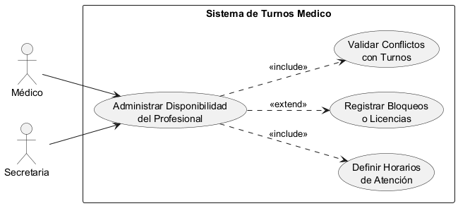
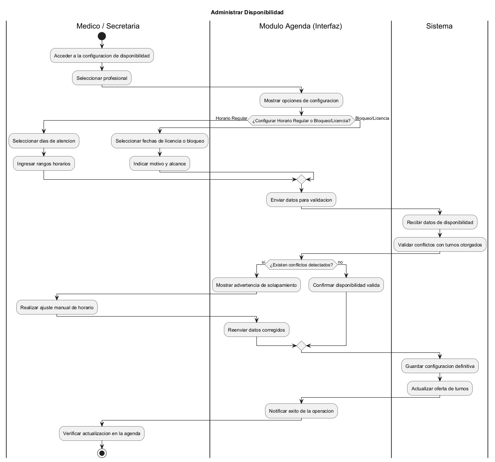
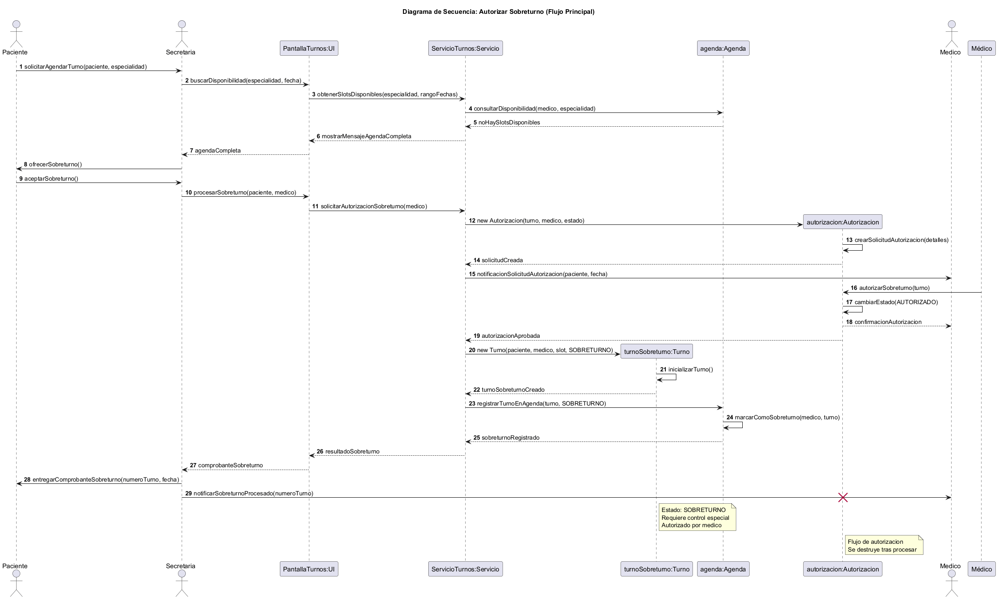
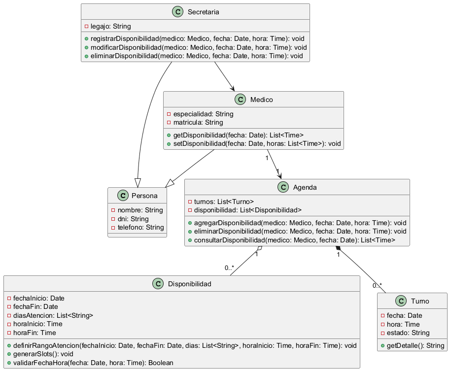

# Análisis Funcional - Caso de Uso 5: Administrar Disponibilidad

## Descripción del caso de uso y trazabilidad con requisitos funcionales

**Actor:** Secretaria

**Flujo principal:**
1. La secretaria selecciona un médico y una fecha.
2. El sistema muestra los horarios actuales.
3. La secretaria agrega o elimina horarios de disponibilidad.
4. El sistema actualiza la agenda del médico.

**Flujos alternativos:**
- Si el médico ya tiene turnos asignados:
  1. El sistema muestra un mensaje indicando que existen turnos asignados en esa franja horaria.
  2. El sistema lista los turnos afectados (paciente, fecha, hora).
  3. El sistema ofrece dos opciones: "Cancelar turnos y eliminar disponibilidad" o "Mantener turnos y no eliminar disponibilidad".
  4. Si el usuario confirma la cancelación, se cancelan los turnos afectados y se elimina la disponibilidad.
  5. Si el usuario no confirma, se cancela la operación y se mantiene la disponibilidad.

**Trazabilidad con RFs (A1):**
- **RF5 (Administrar disponibilidad):** La secretaria puede configurar los horarios de atención de los médicos.

---

## Diagrama de casos de uso (A2)

### Actores y relaciones

| Actor | Rol en el caso de uso |
|-------|----------------------|
| **Secretaria** | Actor principal. Inicia el caso de uso para administrar la disponibilidad de los médicos. |
| **Sistema** | Actor secundario que procesa la consulta y actualiza la disponibilidad. |

**Relaciones:**
- La Secretaria está **asociada** directamente al caso de uso "Administrar Disponibilidad".
- No se utilizan relaciones `include` ni `extend` porque el flujo es directo y no depende de otros casos de uso.

---

## Diagrama de actividades (A3)

### Swimlanes y decisiones clave

**Swimlanes (carriles):**
| Carril | Actor/Componente | Responsabilidad |
|--------|------------------|-----------------|
| Secretaria | Secretaria | Selecciona médico y fecha, administra disponibilidad |
| Sistema | Sistema | Procesa la consulta y actualiza la disponibilidad |

**Decisiones clave del flujo:**
- **¿Hay turnos asignados?** → Si hay turnos, se debe confirmar la eliminación. Si no, se elimina directamente.

---

## Diagrama de secuencia (A3)

### Participantes y mensajes clave

**Participantes:**
| Participante | Notación UML | Tipo |
|--------------|--------------|------|
| Secretaria | `actor` | Actor que inicia el caso de uso |
| PantallaAgenda | `participant` | Clase que muestra la agenda |
| ControladorAgenda | `participant` | Clase que orquesta la administración |
| Agenda | `participant` | Clase que contiene la disponibilidad |
| Disponibilidad | `participant` | Clase que representa un horario disponible |

**Mensajes clave:**
| Mensaje | Origen → Destino | Efecto |
|---------|------------------|--------|
| `administrarDisponibilidad(medico, fecha)` | Secretaria → PantallaAgenda | Inicia la administración de disponibilidad |
| `solicitarAgenda(fecha)` | PantallaAgenda → ControladorAgenda | Solicita la agenda actual |
| `agregarDisponibilidad(medico, fecha, hora)` | ControladorAgenda → Agenda | Agrega un nuevo horario disponible |
| `eliminarDisponibilidad(medico, fecha, hora)` | ControladorAgenda → Agenda | Elimina un horario disponible |

**Objetos temporales destruidos:** No hay objetos temporales en este caso de uso.

---

## Diagrama de clases (CU5)

### Clases involucradas

| Clase | Responsabilidad (según tarjeta CRC) | Tarjeta CRC |
|-------|--------------------------------------|-------------|
| Secretaria | Registrar, modificar y eliminar disponibilidad de médicos | [herramientas-agile/tarjetas-crc/02-tarjeta-crc-secretaria.md](../../herramientas-agile/tarjetas-crc/02-tarjeta-crc-secretaria.md) |
| Medico | Proporcionar su disponibilidad | [herramientas-agile/tarjetas-crc/03-tarjeta-crc-medico.md](../../herramientas-agile/tarjetas-crc/03-tarjeta-crc-medico.md) |
| Agenda | Gestionar disponibilidad y turnos | [herramientas-agile/tarjetas-crc/05-tarjeta-crc-agenda.md](../../herramientas-agile/tarjetas-crc/05-tarjeta-crc-agenda.md) |
| Disponibilidad | Representar un horario disponible | [herramientas-agile/tarjetas-crc/07-tarjeta-crc-disponibilidad.md](../../herramientas-agile/tarjetas-crc/07-tarjeta-crc-disponibilidad.md) |
| Turno | Contener datos de la reserva | [herramientas-agile/tarjetas-crc/04-tarjeta-crc-turno.md](../../herramientas-agile/tarjetas-crc/04-tarjeta-crc-turno.md) |

### Relaciones UML

| Relación | Clases | Justificación |
|----------|--------|---------------|
| Asociación | Secretaria → Medico | La secretaria administra la disponibilidad de los médicos |
| Asociación | Secretaria → Agenda | La secretaria modifica la agenda |
| Agregación | Agenda → Disponibilidad | La agenda contiene disponibilidad (puede existir sin agenda) |
| Composición | Agenda → Turno | La agenda compone turnos (si se elimina la agenda, se eliminan los turnos) |
| Asociación | Medico → Agenda | El médico tiene una agenda asociada |

---

## Pseudocódigo del caso de uso

// Administrar Disponibilidad - Flujo principal

// 1. La secretaria selecciona un médico y una fecha
Secretaria secretaria = new Secretaria("Ana", "S001")
Medico medico = new Medico("Dr. Pérez", "Cardiología", "12345")
Date fecha = new Date("2026-06-15")

// 2. La secretaria consulta la disponibilidad actual
List<Time> horariosActuales = secretaria.consultarDisponibilidad(medico, fecha)

// 3. La secretaria agrega un nuevo horario
secretaria.registrarDisponibilidad(medico, fecha, "14:00")

// 4. El sistema actualiza la agenda
mostrar("Disponibilidad actualizada correctamente")