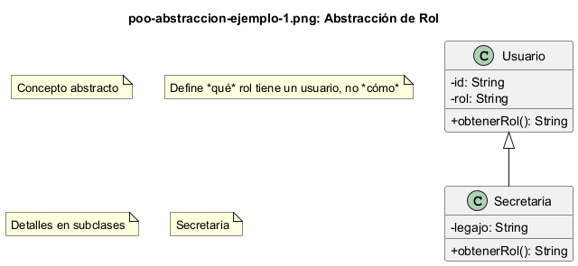
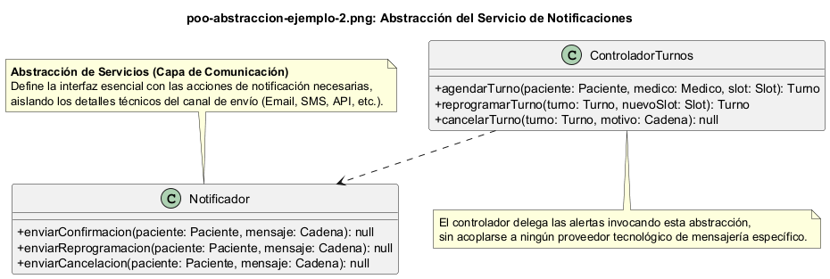
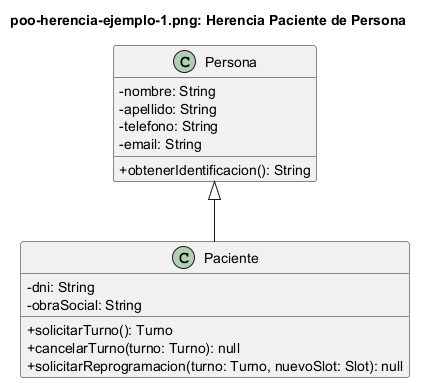
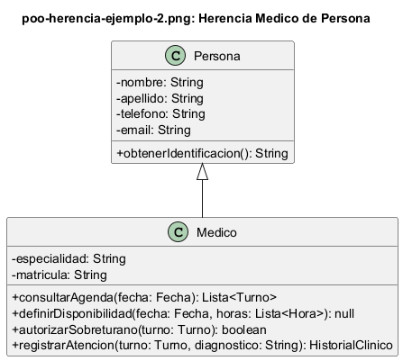
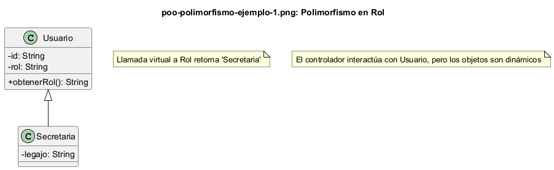
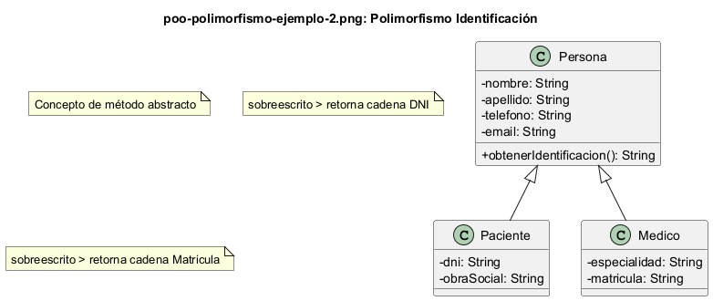

# Los Cuatro Pilares del Paradigma Orientado a Objetos

## 1. Encapsulamiento

**Definición:** El encapsulamiento consiste en ocultar los detalles internos de una clase y exponer solo lo necesario a través de métodos públicos. Los atributos se declaran como privados (`-`) y se accede a ellos mediante métodos públicos (`+`).

### Ejemplo 1: Clase Persona

class Persona {

- nombre: String

- dni: String

- telefono: String
}

Los atributos `nombre`, `dni` y `telefono` son privados. No se puede acceder a ellos directamente desde fuera de la clase. Esto protege los datos y permite controlar cómo se modifican.

**Captura del diagrama:**

### Ejemplo 2: Clase Turno

class Turno {

- fecha: Date

- hora: Time

- estado: String

- getDetalle(): String

- cancelar(): void
}

El atributo `estado` es privado y solo se modifica a través de los métodos públicos `cancelar()` y `reprogramar()`. Esto asegura que el estado del turno solo cambie de forma controlada.

**Captura del diagrama:**

---

## 2. Herencia

**Definición:** La herencia permite que una clase (subclase) herede atributos y métodos de otra clase (superclase), promoviendo la reutilización de código.

### Ejemplo 1: Persona como superclase

Persona --|> Paciente
Persona --|> Medico
Persona --|> Secretaria

`Paciente`, `Medico` y `Secretaria` heredan de `Persona`. Todas comparten atributos como `nombre`, `dni` y `telefono`. Esto evita duplicar código y mantiene la consistencia.

**Captura del diagrama:**

### Ejemplo 2: Agregar especialidad en Medico

class Medico {

- especialidad: String

- matricula: String
}

`Medico` hereda de `Persona` y agrega atributos específicos como `especialidad` y `matricula`. Esto es una extensión natural de la superclase.

**Captura del diagrama:**

---

## 3. Polimorfismo

**Definición:** El polimorfismo permite que diferentes clases respondan al mismo mensaje de forma diferente. Se logra mediante interfaces o métodos sobrescritos.

### Ejemplo 1: Interfaz INotificador

interface INotificador {

- enviarConfirmacion(paciente: Paciente, mensaje: String): void

- enviarCancelacion(paciente: Paciente, mensaje: String): void

- enviarReprogramacion(paciente: Paciente, mensaje: String): void
}

Cualquier clase que implemente `INotificador` (como `Notificador`) debe proveer estas operaciones. El sistema puede usar diferentes implementaciones sin cambiar el código que las invoca.

**Captura del diagrama:**

### Ejemplo 2: Método cancelar() en Turno

class Turno {

- cancelar(): void
}

`Turno` tiene su propia implementación de `cancelar()`. Si en el futuro existiera `Sobreturno`, podría tener su propia versión de `cancelar()` con comportamiento diferente.

**Captura del diagrama:**

---

## 4. Abstracción

**Definición:** La abstracción consiste en representar los conceptos del dominio de forma simplificada, enfocándose en lo esencial y ocultando los detalles innecesarios.

### Ejemplo 1: Interfaces como abstracciones

interface INotificador
interface IRepositorioTurnos

Las interfaces `INotificador` y `IRepositorioTurnos` definen qué hace cada componente, no cómo lo hace. Esto permite cambiar la implementación sin afectar al resto del sistema.

**Captura del diagrama:**

### Ejemplo 2: Clase Agenda

class Agenda {

- turnos: List<Turno>

- disponibilidad: List<Disponibilidad>

- consultarTurnos(fecha: Date): List<Turno>

- verificarDisponibilidad(fecha: Date, hora: Time): Boolean
}

`Agenda` abstrae la lógica de gestión de turnos y disponibilidad. El sistema no necesita saber cómo se almacenan los datos internamente, solo qué operaciones puede realizar.

**Captura del diagrama:**
