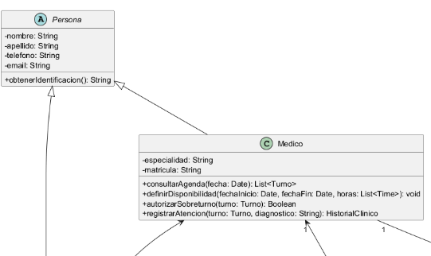
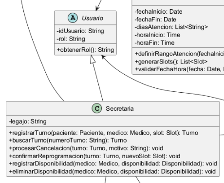

# Abstracción

La abstracción es uno de los pilares del Diseño Orientado a Objetos y consiste en identificar los conceptos esenciales de un problema para representarlos mediante entidades que capturen la información y el comportamiento relevante, sin exponer todos los detalles de implementación. En el contexto del Sistema de Turnos Médicos, este principio permite modelar conceptos como Persona, Turno, Agenda y Disponibilidad como elementos con significado propio dentro del dominio, en lugar de trabajar únicamente con datos aislados o procedimientos dispersos. Su importancia radica en que simplifica la complejidad del sistema, mejora la comprensión del modelo y facilita su mantenimiento y evolución. Además, la abstracción se relaciona con principios SOLID, especialmente con el DIP, porque permite diseñar con base en conceptos generales y no en implementaciones concretas, y con el OCP, ya que favorece la extensión del sistema sin modificar de forma innecesaria las estructuras existentes. En el proyecto, este principio también resulta fundamental para los patrones de diseño aplicados, dado que tanto el Factory Method como el Observer requieren definir abstracciones que permitan extender el comportamiento del software sin acoplarlo a clases concretas.

## Ejemplo en el proyecto
En el proyecto, la abstracción se evidencia principalmente mediante las clases abstractas Persona y Usuario, que representan conceptos generales del dominio y sirven como base para la definición de clases más específicas. La clase Persona agrupa atributos y operaciones compartidos por actores como Paciente y Medico, mientras que la clase Usuario constituye otra abstracción utilizada para representar los usuarios del sistema, de la cual deriva Secretaria. De esta manera, el diseño reconoce una idea común del dominio y evita la duplicación innecesaria de información y comportamiento. Desde el punto de vista técnico, la abstracción permite que las clases derivadas hereden elementos comunes y que el modelo se mantenga coherente frente a cambios futuros. 
La Figura 1 muestra la clase abstracta Persona y su relación de herencia con Paciente y Medico, mientras que la figura 2 muestra la clase abstracta Usuario que constituye la base de Secretaria



**Figura 1.** Aplicación del principio de abstracción mediante las clases abstractas `Persona`  y sus respectivas especializaciones.



**Figura 2.** Aplicación del principio de abstracción mediante las clases abstractas `Usuario`  y sus respectivas especializaciones.

## Ejemplo de código
```java
abstract class Persona {
    protected String nombre;
    protected String apellido;

    public Persona(String nombre, String apellido) {
        this.nombre = nombre;
        this.apellido = apellido;
    }

    public abstract String obtenerIdentificacion();
}

class Paciente extends Persona {
    private String dni;

    public Paciente(String nombre, String apellido, String dni) {
        super(nombre, apellido);
        this.dni = dni;
    }

    @Override
    public String obtenerIdentificacion() {
        return dni;
    }
}

class Medico extends Persona {
    private String matricula;

    public Medico(String nombre, String apellido, String matricula) {
        super(nombre, apellido);
        this.matricula = matricula;
    }

    @Override
    public String obtenerIdentificacion() {
        return matricula;
    }
}
```

En este fragmento, Persona representa la abstracción del concepto general de persona dentro del dominio del sistema, mientras que Paciente y Medico son especializaciones concretas que heredan sus características comunes. El elemento central de la abstracción es la clase abstracta Persona, que define un comportamiento general mediante el método obtenerIdentificacion() y deja a las subclases la responsabilidad de implementar dicho comportamiento según su identidad específica. Este ejemplo demuestra correctamente el pilar de la abstracción porque muestra cómo el diseño puede trabajar con un concepto general del dominio sin necesidad de detallar, en cada caso concreto, toda la estructura de datos y comportamiento compartido. Asimismo, permite construir un sistema más flexible y extensible, ya que nuevas clases relacionadas con personas pueden incorporarse sin destruir la lógica conceptual del modelo.
