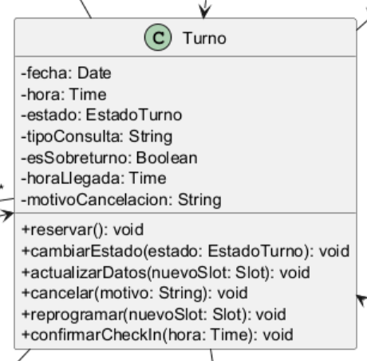

# ENCAPSULAMIENTO

El encapsulamiento es uno de los pilares del Diseño Orientado a Objetos y consiste en ocultar el estado interno de un objeto y exponer únicamente los mecanismos necesarios para interactuar con él. Su objetivo principal es proteger la integridad de los datos, controlar el acceso a los atributos y evitar que el sistema se vea afectado por modificaciones externas no autorizadas. En el diseño de software, este principio resulta fundamental porque permite que cada clase administre su propia lógica de consistencia y que los cambios internos no impacten de manera directa en otras partes del sistema. En el contexto del Sistema de Turnos Médicos, el encapsulamiento se observa en la forma en que las clases del dominio gestionan información sensible como la disponibilidad de horarios, el estado de los turnos y la relación entre los distintos componentes del negocio. Desde la perspectiva de los principios SOLID, el encapsulamiento se relaciona principalmente con el Principio de Responsabilidad Única (SRP), ya que cada clase administra su propio estado y comportamiento, manteniendo una responsabilidad bien definida. Además, favorece la aplicación de otros principios al reducir el acoplamiento entre componentes y limitar el acceso directo a los datos internos. en la medida en que permite que las dependencias operen a través de interfaces o comportamientos controlados en lugar de manipular directamente datos internos. En el proyecto, además, el encapsulamiento se relaciona con los patrones de diseño aplicados, especialmente con el patrón Observer y con el patrón Factory Method, porque ambos requieren que la clase responsable del comportamiento conserve el control sobre su estado y sus cambios.

## Ejemplo en el proyecto
En el Sistema de Turnos Médicos, el encapsulamiento se evidencia claramente en la clase Agenda y en la clase Turno. La clase Agenda mantiene internamente la lista de turnos y la información relacionada con la disponibilidad de la agenda médica, pero expone operaciones controladas como validarDisponibilidad(), agregarTurno() y removerTurnoDeAgenda() para modificar ese estado. De manera similar, Turno encapsula su propio estado, como fecha, hora, tipo de consulta y estado del turno, y ofrece métodos como cambiarEstado(), cancelar() y reprogramar() para gestionar transiciones válidas del ciclo de vida del turno. Estas clases representan el pilar del encapsulamiento porque el estado interno no se modifica de manera libre desde otras clases, sino que se accede mediante operaciones que preservan la coherencia del modelo. Desde el punto de vista técnico, este diseño mejora la seguridad del sistema y evita inconsistencias derivadas de modificaciones directas e indebidas. 
La Figura 3 muestra la clase Turno, donde se observa que sus atributos poseen visibilidad privada (-) y que las modificaciones del estado se realizan mediante métodos públicos (+)



**Figura 3.** Aplicación del principio de encapsulamiento mediante la clase `Turno`, donde los atributos poseen visibilidad privada y las modificaciones de su estado se realizan a través de métodos públicos controlados.

## Ejemplo de código
```java
class Turno {
    private String estado;
    private String motivoCancelacion;

    public void cambiarEstado(String nuevoEstado) {
        this.estado = nuevoEstado;
    }

    public void cancelar(String motivo) {
        this.motivoCancelacion = motivo;
        this.estado = "CANCELADO";
    }
}
```

En este fragmento, la clase Turno encapsula su estado interno mediante atributos privados y expone únicamente operaciones específicas para modificarlo. El atributo estado no puede ser alterado directamente desde fuera de la clase, lo que garantiza que los cambios se realicen bajo reglas controladas. Este ejemplo demuestra correctamente el pilar del encapsulamiento porque muestra cómo el comportamiento de un objeto queda protegido y cómo el acceso a su información se restringe a métodos definidos por la propia clase, favoreciendo la coherencia y la seguridad del diseño.
