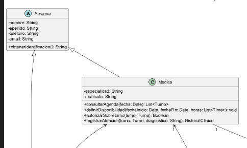

# HERENCIA

La herencia es uno de los pilares del Diseño Orientado a Objetos y consiste en la capacidad de una clase de derivar características y comportamientos de otra clase existente, permitiendo construir jerarquías de generalización y especialización. En el diseño de software, este fundamento tiene como objetivo principal reutilizar estructuras comunes, reducir la duplicación de código y organizar el modelo conceptual de manera más clara y mantenible. Su importancia radica en que facilita la extensión del sistema, ya que nuevas clases pueden incorporarse a partir de una abstracción previa sin requerir la redefinición completa de atributos o métodos compartidos. En el proyecto del Sistema de Turnos Médicos, la herencia aparece de manera relevante en el modelo de dominio, donde las clases Paciente, Medico y Secretaria comparten rasgos comunes con clases base como Persona y Usuario. Desde la perspectiva de los principios SOLID, la herencia está estrechamente relacionada con el Liskov Substitution Principle (LSP), porque las subclases deben poder sustituir a su clase base sin alterar el comportamiento esperado del sistema, y también con el Open/Closed Principle (OCP), en la medida en que permite ampliar el diseño mediante nuevas especializaciones sin modificar la estructura base. En cuanto a los patrones de diseño, su relación es más indirecta, pero resulta significativa en el uso de abstracciones que sirven de base para extensiones posteriores, como las que se observan en los diagramas del sistema y en el diseño orientado a dominio.

## Ejemplo en el proyecto
En el Sistema de Turnos Médicos, la herencia se observa de forma clara en la relación entre la clase abstracta Persona y las clases Paciente, Medico y Secretaria. Estas clases representan especializaciones de un concepto más general, ya que comparten atributos comunes, como nombre, apellido, teléfono y correo electrónico, pero además incorporan características propias según su rol dentro del sistema. La clase Persona funciona como una abstracción base que define un modelo general de identidad y permite que las subclases concentren únicamente los detalles específicos que las diferencian. Desde el punto de vista técnico, esta relación cumple con el pilar de la herencia porque existe una relación de tipo generalización-especialización entre una clase base y varias clases derivadas, lo que favorece la reutilización y la organización del dominio.



**Figura 0.** Aplicación del principio de herencia mediante las relaciones de generalización entre las clases `Persona`, `Paciente` y `Medico`, y entre `Usuario` y `Secretaria`, donde las clases derivadas heredan los atributos y comportamientos definidos en sus respectivas superclases.

## Ejemplo de código
```java
abstract class Persona {
    protected String nombre;
    protected String apellido;

    public Persona(String nombre, String apellido) {
        this.nombre = nombre;
        this.apellido = apellido;
    }

@Override
public String obtenerIdentificacion() {
    return dni;
}

class Paciente extends Persona {
    private String dni;

    public Paciente(String nombre, String apellido, String dni) {
        super(nombre, apellido);
        this.dni = dni;
    }
}

class Medico extends Persona {
    private String matricula;

    public Medico(String nombre, String apellido, String matricula) {
        super(nombre, apellido);
        this.matricula = matricula;
    }
}
```

En este fragmento, Persona representa la clase base del modelo, mientras que Paciente y Medico son subclases que heredan sus atributos y constructor comunes. La herencia se aplica porque ambas clases reutilizan la estructura definida en Persona y agregan sus propios datos específicos, sin repetir la lógica compartida. Este ejemplo demuestra correctamente el pilar de la herencia porque muestra cómo una clase más general puede servir de fundamento para varias especializaciones, favoreciendo la organización del diseño y la reutilización de componentes dentro del sistema.
