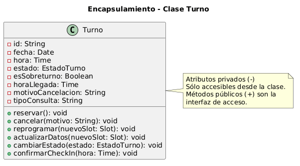

# Encapsulamiento

## Explicación del concepto

El **encapsulamiento** consiste en ocultar los detalles internos de un objeto y exponer solo lo necesario a través de una interfaz pública. Los atributos se declaran como privados y se accede a ellos mediante métodos públicos.

**Relación con SOLID y patrones de diseño:**
- **SRP** (Responsabilidad Única): el encapsulamiento permite que cada clase gestione su propio estado.
- **OCP** (Abierto/Cerrado): el encapsulamiento protege la lógica interna, permitiendo cambios seguros.
- **Patrón Singleton**: encapsula la creación de una única instancia.
- **Patrón Facade**: encapsula la complejidad de un subsistema.

## Ejemplo en el proyecto

**Clase seleccionada:** `Turno`

**Diagrama UML:**



*En este diagrama se observa la clase Turno con sus atributos privados y métodos públicos. El encapsulamiento protege el estado interno del objeto (fecha, hora, estado) y solo permite modificarlo a través de métodos controlados como `cancelar()` o `reprogramar()`.*

## Ejemplo de código

```java
class Turno {
    // Atributos privados (no accesibles desde fuera)
    private Date fecha;
    private Time hora;
    private String estado;

    // Métodos públicos (interfaz)
    public String getEstado() {
        return this.estado;
    }

    public void cancelar() {
        if (this.estado == "CONFIRMADO") {
            this.estado = "CANCELADO";
            this.notificarObservadores("CANCELADO");
        }
    }

    public void reprogramar(Date nuevaFecha) {
        if (this.estado == "CONFIRMADO") {
            this.fecha = nuevaFecha;
            this.notificarObservadores("REPROGRAMADO");
        }
    }
}

// Uso
Turno turno = new Turno("2026-06-20", "10:00", "CONFIRMADO");
turno.cancelar(); // ✅ Válido, cambia el estado
// turno.estado = "CANCELADO"; // ❌ Inválido, el atributo es privado
```

## Justificación técnica

En el código, los atributos `fecha`, `hora` y `estado` están declarados como `private`. Esto significa que no se puede acceder a ellos desde fuera de la clase. Solo se pueden modificar a través de métodos públicos como `cancelar()` o `reprogramar()`. Esto protege la integridad del objeto y evita estados inconsistentes.