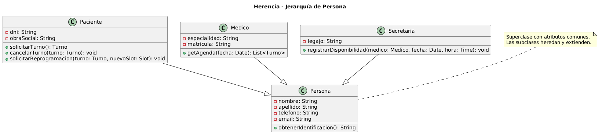

# Herencia

## Explicación del concepto

La **herencia** permite que una clase (subclase) herede atributos y métodos de otra clase (superclase). Promueve la reutilización de código y la creación de jerarquías de clases.

**Relación con SOLID y patrones de diseño:**
- **LSP** (Sustitución de Liskov): las subclases deben poder sustituir a sus superclases.
- **OCP** (Abierto/Cerrado): la herencia permite extender el sistema sin modificar código existente.
- **Patrón Template Method**: utiliza herencia para definir el esqueleto de un algoritmo.
- **Patrón Factory Method**: las subclases deciden qué clase instanciar.

## Ejemplo en el proyecto

**Clases seleccionadas:**
- `Persona` (superclase)
- `Paciente`, `Medico`, `Secretaria` (subclases)

**Diagrama UML:**



*En este diagrama se observa la jerarquía de herencia: Persona como superclase con atributos comunes, y Paciente, Medico y Secretaria como subclases que heredan estos atributos y agregan los suyos propios.*

## Ejemplo de código

```java
// Superclase
class Persona {
    private String nombre;
    private String dni;
    private String telefono;

    public String getNombre() {
        return this.nombre;
    }
}

// Subclase 1 (hereda de Persona)
class Paciente extends Persona {
    private String obraSocial;

    public String getObraSocial() {
        return this.obraSocial;
    }
}

// Subclase 2 (hereda de Persona)
class Medico extends Persona {
    private String especialidad;
    private String matricula;

    public String getEspecialidad() {
        return this.especialidad;
    }
}

// Subclase 3 (hereda de Persona)
class Secretaria extends Persona {
    private String legajo;

    public String getLegajo() {
        return this.legajo;
    }
}

// Uso (polimorfismo por herencia)
void imprimirNombre(Persona persona) {
    System.out.println(persona.getNombre());
}

Paciente paciente = new Paciente();
paciente.setNombre("Juan");
paciente.setDni("12345678");
paciente.setTelefono("011-1234567");
paciente.setObraSocial("OSDE");

Medico medico = new Medico();
medico.setNombre("Dra. Pérez");
medico.setDni("87654321");
medico.setTelefono("011-998877");
medico.setEspecialidad("Cardiología");
medico.setMatricula("M-001");

Secretaria secretaria = new Secretaria();
secretaria.setNombre("Ana");
secretaria.setDni("11111111");
secretaria.setTelefono("011-1111111");
secretaria.setLegajo("S-001");

imprimirNombre(paciente);    // "Juan"
imprimirNombre(medico);      // "Dra. Pérez"
imprimirNombre(secretaria);  // "Ana"
```

## Justificación técnica

En el código, la palabra clave `extends` indica que `Paciente`, `Medico` y `Secretaria` **heredan** de `Persona`. Esto significa que las subclases tienen automáticamente los atributos y métodos de `Persona` (`nombre`, `dni`, `telefono`, `getNombre()`). Cada subclase agrega sus propios atributos específicos (`obraSocial`, `especialidad`, `legajo`). La función `imprimirNombre()` recibe `Persona` y funciona con cualquier subclase, demostrando la reutilización y consistencia que ofrece la herencia.