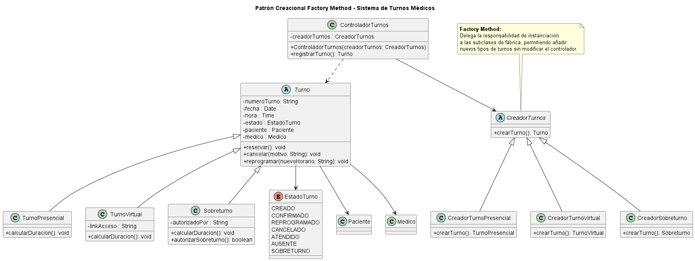

# Informe Técnico: Patrón de Diseño Creacional - Factory Method

## 1. Introducción a los Patrones Creacionales y su relación con SOLID
Los patrones creacionales abstraen el proceso de instanciación de objetos. Ayudan a que un sistema sea independiente de cómo se crean, componen y representan sus objetos. 
Su relación con los principios SOLID es directa:
* **SRP (Responsabilidad Única):** Extrae el comportamiento de creación de objetos de las clases de negocio principales (como los controladores).
* **OCP (Abierto/Cerrado):** Permite introducir nuevos tipos de productos (en este caso, nuevas modalidades de Turnos) al sistema sin romper ni modificar el código cliente existente.
* **LSP (Principio de Sustitución de Liskov):** Garantiza que cualquier implementación concreta creada mediante un patrón creacional pueda utilizarse en lugar de su abstracción sin alterar el comportamiento esperado del sistema.
* **ISP (Principio de Segregación de Interfaces):** Favorece el uso de interfaces específicas para la creación de objetos, evitando que las clases dependan de métodos de creación que no necesitan implementar o utilizar.
* **DIP (Principio de Inversión de Dependencias):** Los clientes dependen de abstracciones (interfaces o clases abstractas) en lugar de implementaciones concretas. Los patrones creacionales facilitan esta inversión al delegar la creación de objetos a fábricas o constructores especializados, reduciendo el acoplamiento entre módulos.

## 2. Propósito y Tipo del Patrón Seleccionado
* **Patrón:** Factory Method (Método de Fábrica).
* **Tipo:** Creacional.
* **Propósito:** Definir una interfaz para la creación de objetos, permitiendo que las subclases determinen qué producto concreto instanciar y desacoplando al cliente del proceso de creación.

En el diseño original, el problema se encontraba en el método encargado de registrar o reservar turnos dentro de ControladorTurnos, donde la creación de objetos Turno se realizaba mediante instanciación directa. Esta solución obligaba al controlador a conocer las clases concretas de los distintos tipos de turnos, generando un fuerte acoplamiento entre la lógica de negocio y la lógica de creación de objetos.

Este diseño vulneraba principalmente el Principio Abierto/Cerrado (OCP), ya que la incorporación de una nueva modalidad de turno requería modificar el controlador para agregar nuevas condiciones de creación. Asimismo, incumplía el Principio de Inversión de Dependencias (DIP), debido a que el controlador dependía de clases concretas en lugar de abstraerse mediante interfaces o clases abstractas.

Se seleccionó el patrón Factory Method porque el problema consiste exclusivamente en decidir qué subtipo de Turno debe instanciarse según el contexto de ejecución. Este patrón encapsula dicha decisión en creadores especializados, permitiendo que el controlador trabaje únicamente con la abstracción Turno, reduciendo el acoplamiento y facilitando la extensión del sistema.

Se descartó el uso de Builder, ya que este patrón está orientado a la construcción paso a paso de objetos complejos con múltiples configuraciones, situación que no se presenta en la creación de un turno. También se descartó Abstract Factory, debido a que su propósito es crear familias completas de objetos relacionados; en este caso únicamente es necesario crear diferentes variantes de un mismo producto (Turno), por lo que Factory Method constituye la solución más simple y adecuada.

## 3. Motivación Detallada del Problema y la Solución
* **Problema:** En el diseño inicial unificado, el `ControladorTurnos` creaba instancias directas de la clase concreta `Turno`. Esto generaba un acoplamiento rígido con las clases del diagrama final, como `Agenda`, `Paciente`, `Medico`, `Secretaria`, `Slot` y `Disponibilidad`, porque cualquier variación en los datos de un turno obligaba a cambiar la lógica de orquestación y persistencia de `ControladorTurnos` y `ServicioTurnos`.
* **Escenario de impacto:** El diagrama final muestra que `Turno` es la entidad que relaciona `Paciente`, `Medico` y `Slot`, y que la `Agenda` valida y contiene los turnos. Si se incorporaban nuevas modalidades específicas de turno, el flujo de datos y las validaciones debían adaptarse en múltiples puntos del sistema, volviendo frágil la arquitectura.
* **Modalidades de turno con particularidades:**
  * `TurnoPresencial`: requiere validación de disponibilidad física del consultorio, cálculo de duración según la especialidad y registro de la llegada del paciente al consultorio.
  * `TurnoVirtual` (Telemedicina): necesita un `linkAcceso` o credencial de sesión virtual, control de conexión remota y ajuste de duración sin dependencia de un espacio físico; la `Agenda` lo trata como un turno asociado a un slot, pero con atributos distintos.
  * `Sobreturno`: actúa como excepción autorizada por `Medico`, tiene bandera `esSobreturno` y autorización explícita, y la `Agenda` debe validar que no se superen los límites de superposición permitidos para un mismo profesional.
* **Solución:** Introducir una estructura abstracta de creación (`CreadorTurnos`) y derivar fábricas concretas para cada subtipo de turno. El `ControladorTurnos` y `ServicioTurnos` ahora interactúan con la abstracción `CreadorTurnos` en lugar de con la clase concreta `Turno`, logrando un desacoplamiento que respeta el diseño del diagrama final y permite extender las modalidades sin romper la lógica de `Agenda`, `Paciente` o `Secretaria`.

## 4. Estructura de Clases con Diagrama UML

La siguiente figura muestra la estructura de clases correspondiente a la implementación del patrón **Factory Method** en el sistema de turnos médicos.

El archivo fuente del diagrama se encuentra disponible en:

- `diagramas/01-diagrama-clases/01-patron-creacional-factory.puml`

## 5. Participantes del Patrón

- Creador (`CreadorTurnos`)
La clase abstracta `CreadorTurnos` representa el Creator del patrón y define el contrato de instanciación mediante el método `crearTurno()`. Su responsabilidad es exponer la operación de creación sin conocer qué subclase concreta de `Turno` será generada. En este diseño, `CreadorTurnos` aporta el punto fijo de abstracción que permite que `ControladorTurnos` y `ServicioTurnos` dependan de una interfaz de fábrica en lugar de depender de productos concretos.

- Creadores Concretos (`CreadorTurnoPresencial`, `CreadorTurnoVirtual`, `CreadorSobreturno`)
Las clases `CreadorTurnoPresencial`, `CreadorTurnoVirtual` y `CreadorSobreturno` son los Concrete Creators. Cada una especializa `crearTurno()` para construir una variante específica de producto: `TurnoPresencial`, `TurnoVirtual` o `Sobreturno`. Su interacción con `CreadorTurnos` es de herencia y con `ControladorTurnos` es de dependencia a través de la abstracción. Estas clases concretas aportan la capacidad de extender el sistema con nuevas modalidades de turno sin modificar al cliente ni a la abstracción común.

- Producto (`Turno`)
`Turno` actúa como el Product abstracto del patrón. Es la clase base que define el comportamiento común de los turnos médicos y permite que los objetos retornados por los factories sean tratados de forma uniforme. Dentro del patrón, `Turno` habilita el polimorfismo porque `ControladorTurnos`, `Agenda`, `RepositorioTurnos` y `ServicioTurnos` pueden manejar referencias de tipo `Turno` sin conocer la implementación concreta, lo que reduce el acoplamiento y facilita la inclusión de nuevas variantes.

- Productos Concretos (`TurnoPresencial`, `TurnoVirtual`, `Sobreturno`)
Los Concrete Products son `TurnoPresencial`, `TurnoVirtual` y `Sobreturno`. Cada uno hereda de `Turno` e incorpora atributos y comportamiento específicos para su modalidad: `TurnoPresencial` está orientado a la validación de disponibilidad del consultorio, `TurnoVirtual` contiene un `linkAcceso` y campos propios de telemedicina, y `Sobreturno` incluye la bandera `esSobreturno` y la lógica de autorización médica. Estos productos permiten que la fábrica devuelva objetos polimórficos que respetan la interfaz general del dominio.

- Cliente (`ControladorTurnos`)
El cliente principal es `ControladorTurnos`, que orquesta la solicitud de creación de turnos. En lugar de construir objetos `Turno` directamente, `ControladorTurnos` invoca `crearTurno()` sobre una referencia a `CreadorTurnos`. De este modo, su dependencia es hacia la abstracción de fábrica y no hacia las implementaciones concretas de `Turno`. Para el patrón, esto es clave: `ControladorTurnos` actúa como consumidor de productos polimórficos y delega la elección de la variante concreta al Concrete Creator adecuado.

- Colaboración entre participantes
El flujo de colaboración arranca con `ControladorTurnos`, que recibe o inyecta una instancia de `CreadorTurnos`. Cuando se solicita un nuevo turno, el cliente llama `crearTurno()` y la responsabilidad de construcción recae en el Concrete Creator elegido (`CreadorTurnoPresencial`, `CreadorTurnoVirtual` o `CreadorSobreturno`). El Concrete Creator instancia el Concrete Product correspondiente y devuelve una referencia de tipo `Turno`. Esa referencia polimórfica es consumida por `Agenda`, `RepositorioTurnos` y `ServicioTurnos`, que operan sobre la abstracción `Turno` y no sobre clases concretas.

- Aporte al funcionamiento del Factory Method
Cada participante contribuye a la flexibilidad del patrón: `CreadorTurnos` formaliza la operación de fábrica, los Concrete Creators encapsulan la lógica de selección de variante, `Turno` define el contrato común y los Concrete Products materializan las diferencias específicas de cada tipo de turno. Gracias a esta estructura, el cliente `ControladorTurnos` puede gestionar turnos heterogéneos sin condicionales de tipo o conocimiento directo de `TurnoPresencial`, `TurnoVirtual` o `Sobreturno`, lo que preserva el diseño orientado a objetos y facilita la extensión del sistema. 

## 6. Comportamiento del Patrón

A continuación se describe el flujo completo de creación de un objeto utilizando las clases reales del proyecto, paso a paso:

| Paso | Descripción |
|------|-------------|
| 1 | **Inicio de la solicitud:** El proceso se inicia cuando `ControladorTurnos` necesita registrar un nuevo turno en el sistema, ya sea por solicitud de un paciente, una secretaria o por generación automática. |
| 2 | **Intervención del cliente:** `ControladorTurnos` actúa como el cliente del patrón. En lugar de instanciar directamente una clase concreta de `Turno`, el controlador opera sobre la abstracción de fábrica. |
| 3 | **Obtención del Creator:** `ControladorTurnos` recibe o tiene inyectada una referencia a la clase abstracta `CreadorTurnos`, que representa el Creator del patrón Factory Method. Esta referencia puede provenir de un mecanismo de inyección de dependencias o de una instancia previamente configurada según el tipo de turno requerido. |
| 4 | **Invocación del método fábrica:** El cliente invoca el método `crearTurno()` sobre la referencia de tipo `CreadorTurnos`, delegando la responsabilidad de construcción del objeto a la fábrica. |
| 5 | **Selección del Concrete Creator:** Según el tipo de turno solicitado (presencial, virtual o sobreturno), se utiliza el Concrete Creator correspondiente: `CreadorTurnoPresencial`, `CreadorTurnoVirtual` o `CreadorSobreturno`. Cada uno de estos concretos hereda de `CreadorTurnos` y especializa la operación de fábrica. |
| 6 | **Instanciación del Concrete Product:** El Concrete Creator seleccionado instancia el Concrete Product correspondiente: `TurnoPresencial`, `TurnoVirtual` o `Sobreturno`. Durante esta instanciación, el Concrete Creator configura los atributos específicos de cada modalidad (por ejemplo, `linkAcceso` en `TurnoVirtual`, la bandera `esSobreturno` en `Sobreturno`, o las validaciones de consultorio en `TurnoPresencial`). |
| 7 | **Retorno como abstracción:** El objeto recién creado se devuelve al cliente como una referencia de tipo `Turno` (la abstracción del producto), ocultando la implementación concreta específica. |
| 8 | **Consumo polimórfico:** La referencia de tipo `Turno` es consumida por el resto de las clases del sistema —`Agenda`, `RepositorioTurnos` y `ServicioTurnos`— sin que estas conozcan ni dependan de la clase concreta instanciada. Estas clases operan únicamente sobre la interfaz común definida por `Turno`, manteniendo el desacoplamiento. |

### Explicación del impacto en el acoplamiento y los principios OCP y DIP

Este flujo reduce significativamente el acoplamiento en el sistema porque `ControladorTurnos` y los servicios de aplicación dependen exclusivamente de la abstracción `CreadorTurnos` y de la interfaz `Turno`, sin mantener referencias directas a las clases concretas `TurnoPresencial`, `TurnoVirtual` o `Sobreturno`. Al eliminar los condicionales de tipo (`if`/`switch`) que evaluaban el tipo de turno para decidir qué clase instanciar, el diseño respeta el **Principio Abierto/Cerrado (OCP)**: la incorporación de una nueva modalidad de turno no requiere modificar el código del cliente ni de la abstracción común, sino únicamente agregar un nuevo Concrete Creator y un nuevo Concrete Product. Asimismo, el patrón cumple con el **Principio de Inversión de Dependencias (DIP)**, ya que las capas superiores del sistema (`ControladorTurnos`, `Agenda`, `ServicioTurnos`) dependen de abstracciones en lugar de implementaciones concretas, y la creación de objetos se delega a componentes especializados que encapsulan dicha lógica.

## 7. Justificación Técnica de la Solución Propuesta
En la implementación concreta del proyecto, el rol de Creator lo cumple la clase abstracta `CreadorTurnos`, que define el contrato de creación mediante el método `crearTurno()`. Los Concrete Creators se representan por las clases `CreadorTurnoPresencial`, `CreadorTurnoVirtual` y `CreadorSobreturno`; cada una de estas subclases especializa la operación de fábrica para devolver un producto concreto específico. El Product es la clase abstracta `Turno`, mientras que los Concrete Products son `TurnoPresencial`, `TurnoVirtual` y `Sobreturno`, que heredan de `Turno` y añaden las particularidades necesarias para cada modalidad del turno médico.

El rol de `CreadorTurnos` es mantener la abstracción de instanciación y de esta manera separar la lógica de creación del resto de la aplicación. `CreadorTurnoPresencial` concentra la construcción de turnos presenciales, `CreadorTurnoVirtual` concentra la creación de turnos de telemedicina con atributos como `linkAcceso`, y `CreadorSobreturno` administra la creación de turnos excepcionales que requieren autorización del médico. `ControladorTurnos` actúa como cliente del patrón; recibe o inyecta una referencia a `CreadorTurnos` y delega en ella la generación del objeto `Turno` en lugar de crear instancias directas de las clases concretas.

En el flujo de creación de objetos, el proceso se inicia cuando `ControladorTurnos` necesita registrar un nuevo turno en el sistema. En lugar de evaluar el tipo de turno mediante condicionales, `ControladorTurnos` invoca `crearTurno()` sobre la abstracción `CreadorTurnos`. El Concrete Creator elegido ya conoce el tipo de turno requerido y, en su implementación, instancia la clase `TurnoPresencial`, `TurnoVirtual` o `Sobreturno`, configura sus propiedades específicas y devuelve la referencia al cliente. De ese modo `ControladorTurnos` recibe un `Turno` polimórfico que puede ser manejado por la `Agenda`, persistido por `RepositorioTurnos` y utilizado por `ServicioTurnos` sin depender de detalles de construcción.

Esta implementación reduce el acoplamiento porque `ControladorTurnos` y los servicios de aplicación ya no dependen de implementaciones concretas de producto. En lugar de interceptar la creación con `if/switch` basados en strings o en valores de `tipoConsulta`, el sistema sólo conoce el contrato `CreadorTurnos` y la abstracción `Turno`. El resultado es una arquitectura que respeta el Principio de Inversión de Dependencias (DIP), dado que las capas superiores dependen de abstracciones en lugar de clases concretas, y el Principio Abierto/Cerrado (OCP), porque la incorporación de un nuevo tipo de turno se realiza añadiendo un nuevo `Concrete Creator` y un nuevo `Concrete Product` sin modificar el cliente existente ni el flujo de orquestación.

Finalmente, el patrón Factory Method facilita la extensión del dominio de turnos en el sistema de turnos médicos. Si el proyecto necesitara una nueva modalidad de atención, bastaría con introducir una clase adicional que herede de `Turno` y una fábrica concreta que implemente `crearTurno()` en `CreadorTurnos`; `ControladorTurnos` y la `Agenda` seguirían operando con la abstracción común, manteniendo el código estable y minimizando el riesgo de efectos colaterales al añadir nuevas variantes de producto.