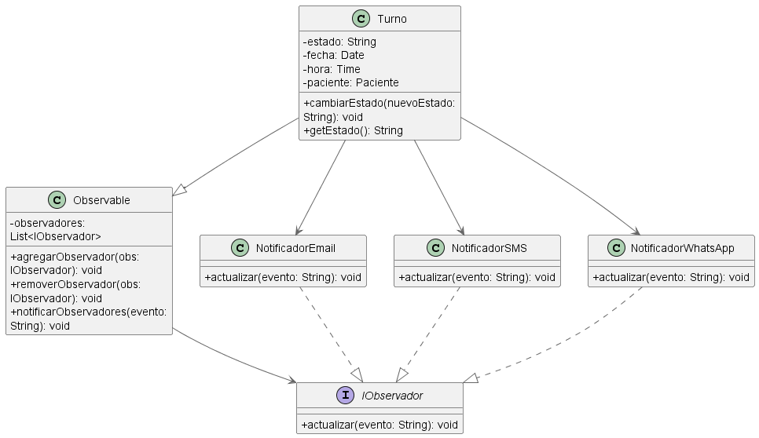

# Anexo – Aplicación de Patrón de Diseño de Comportamiento – Observer

## Patrones de Diseño de Comportamiento y su relación con SOLID

Los patrones de diseño de comportamiento se ocupan de los algoritmos y la asignación de responsabilidades entre objetos. En lugar de codificar comportamientos rígidos, estos patrones permiten que el sistema sea más flexible y extensible, facilitando la modificación de la lógica sin afectar otras partes del código.

En particular, el patrón **Observer** se relaciona directamente con el principio **Open/Closed (OCP)** y **Dependency Inversion (DIP)**, ya que permite agregar nuevos observadores sin modificar el sujeto observado, y ambas partes dependen de abstracciones (interfaces).

## Propósito y Tipo del Patrón

**Propósito:**  
En el sistema de turnos médicos, existía un problema de acoplamiento fuerte en la lógica de notificaciones. Cada vez que se creaba, cancelaba o reprogramaba un turno, el código debía llamar directamente a múltiples servicios de notificación (email, SMS, WhatsApp, etc.). Esto generaba código duplicado y difícil de mantener. El patrón Observer resuelve esto permitiendo que el **Sujeto** (Turno) mantenga una lista de **Observadores** (Notificadores) y los notifique automáticamente ante cualquier cambio de estado.

**Tipo:**  
Observer es un patrón de comportamiento que define una dependencia uno-a-muchos entre objetos, de modo que cuando un objeto cambia de estado, todos sus dependientes son notificados y actualizados automáticamente. Es ideal para manejar eventos y notificaciones en tiempo real sin acoplamiento.

## Motivación

Originalmente, el sistema manejaba las notificaciones mediante llamadas directas a métodos de clases concretas, como `EnviarEmail()`, `EnviarSMS()` y `EnviarWhatsApp()`. Esto provocaba:

- **Alto acoplamiento:** cada clase que modificaba un turno debía conocer todos los servicios de notificación.
- **Dificultad para agregar nuevos canales:** cada nuevo medio implicaba modificar todas las clases que notificaban.
- **Violación de SRP:** las clases de negocio tenían responsabilidades de notificación.

Con el patrón Observer, se introduce:

- **Interfaz `IObservador`:** define el método `actualizar(evento)`.
- **Clase `Sujeto` (Turno):** mantiene la lista de observadores y notifica cambios.
- **Observadores concretos:** `NotificadorEmail`, `NotificadorSMS`, `NotificadorWhatsApp` que implementan `IObservador`.

El flujo ahora es:

1. El paciente o secretaria realiza una acción (crear/cancelar/reprogramar turno).
2. El turno cambia su estado y ejecuta `notificarObservadores()`.
3. Cada observador reacciona según su canal (envía email, SMS, etc.).

Esto desacopla completamente la lógica de notificación de la lógica de negocio, facilitando agregar nuevos canales sin modificar las clases existentes.

## Estructura de Clases

Solo se incluyen las clases directamente relacionadas con la implementación del patrón Observer, para mantener claridad y enfoque.

*Ver diagrama en tamaño completo: [01-patron-comportamiento-observer.puml](../../diagramas/01-diagrama-clases/01-patron-comportamiento-observer.puml)*

## Justificación Técnica de la Estructura de Clases

### Clases incluidas en el diagrama:

| Clase | Responsabilidad | Relación |
|-------|----------------|----------|
| `Turno` | Sujeto observable. Mantiene estado y notifica cambios a los observadores. | Implementa `Observable` (abstracto) |
| `IObservador` | Interfaz que define el método `actualizar(evento)` | Implementada por observadores concretos |
| `NotificadorEmail` | Observador concreto que envía email ante un evento | Implementa `IObservador` |
| `NotificadorSMS` | Observador concreto que envía SMS ante un evento | Implementa `IObservador` |
| `NotificadorWhatsApp` | Observador concreto que envía mensaje por WhatsApp | Implementa `IObservador` |

### Flujo de comportamiento:

1. El `Turno` cambia su estado (`creado`, `cancelado`, `reprogramado`).
2. Se invoca el método `notificarObservadores(evento)`.
3. El `Turno` recorre su lista de observadores y llama a `actualizar(evento)` en cada uno.
4. Cada observador reacciona según su canal, enviando el mensaje correspondiente.

Este diseño permite agregar nuevos observadores (por ejemplo, `NotificadorPush`) sin modificar la clase `Turno`, cumpliendo con OCP y DIP.