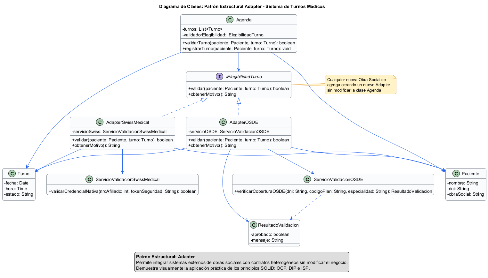

# Patrón de Diseño Estructural: Adapter (Adaptador)

## 1. Introducción a los Patrones Estructurales y su relación con SOLID
Los patrones estructurales se centran en cómo se combinan las clases y objetos para formar estructuras más complejas y eficientes sin perder flexibilidad. En el contexto del Sistema de Turnos Médicos del Dr. Molina, la adopción del patrón **Adapter** establece un puente limpio entre el dominio interno de la aplicación y servicios externos heterogéneos. 

Su relación con los principios SOLID es directa y fundamental:
* **Open/Closed Principle (OCP):** El sistema queda abierto a la extensión y cerrado a la modificación. Es posible incorporar nuevos proveedores de salud (obras sociales o prepagas) implementando nuevos adaptadores sin alterar las clases existentes (como `Agenda` o `Turno`).
* **Dependency Inversion Principle (DIP):** Las clases de alto nivel (`Agenda`) ya no dependen de las APIs concretas e inestables de terceros, sino de una abstracción de bajo acoplamiento (`IElegibilidadTurno`).
* **Interface Segregation Principle (ISP):** La interfaz de comunicación con el cliente se mantiene pequeña, cohesiva y específica para las necesidades de nuestro negocio (`validar()` y `obtenerMotivo()`), evitando que el sistema dependa de métodos complejos u obsoletos de los sistemas externos.
* **Single Responsibility Principle (SRP):** La responsabilidad de transformar y mapear los tipos de datos del dominio interno hacia los contratos de los sistemas externos queda encapsulada exclusivamente dentro de su respectiva clase adaptadora.
* **Liskov Substitution Principle (LSP):** Todos los adaptadores concretos pueden sustituir a la abstracción `IElegibilidadTurno` sin alterar el comportamiento esperado por el sistema. De esta manera, `Agenda` interactúa únicamente con la interfaz común y puede utilizar indistintamente cualquier adaptador (por ejemplo, para una obra social o prepaga diferente) sin requerir cambios en su lógica de negocio.

## 2. Propósito y Tipo del Patrón Seleccionado

* **Tipo:** Estructural.

* **Propósito:** El patrón **Adapter** convierte la interfaz de una clase externa en otra interfaz compatible con la que espera el sistema. De esta manera, permite integrar componentes con interfaces incompatibles sin modificar su implementación original.

En el sistema de turnos médicos, el acoplamiento original se encuentra en la clase encargada de validar la cobertura médica (por ejemplo, el servicio de validación de obra social), donde sería necesario invocar directamente los métodos específicos de cada prestador (`validarAfiliado()`, `consultarCobertura()`, `verificarSocio()`, etc.). Esta dependencia obligaría a modificar el código cada vez que se incorpore un nuevo prestador o cambie la interfaz de uno existente.

La aplicación del patrón **Adapter** elimina este acoplamiento al proporcionar una interfaz común que abstrae las diferencias entre los distintos prestadores. De este modo, el sistema interactúa únicamente con el contrato definido por el adaptador, mientras que cada adaptador concreto traduce las llamadas a la API correspondiente.

Se analizaron otros patrones estructurales del catálogo GoF y se descartaron por no ajustarse al problema planteado. El patrón **Facade** proporciona una interfaz simplificada para acceder a un subsistema complejo, pero no resuelve la incompatibilidad entre interfaces diferentes ni adapta el comportamiento de componentes externos. Por su parte, **Proxy** controla el acceso a un objeto, incorporando funcionalidades como control de acceso, carga diferida o almacenamiento en caché, pero mantiene la misma interfaz del objeto original y no transforma una interfaz en otra compatible.

Por estas razones, **Adapter** resulta el patrón más apropiado para este caso, ya que resuelve directamente el problema de interoperabilidad entre el sistema de turnos y los distintos prestadores de salud, permitiendo incorporar nuevos proveedores sin modificar la lógica de negocio y favoreciendo la extensibilidad y el bajo acoplamiento.

## 3. Motivación Detallada del Problema y la Solución
* **Problema:** El Dr. Molina requiere que el sistema valide si un turno médico es elegible para cobertura por parte de la Obra Social o Prepaga del paciente antes de consolidar el registro. Sin embargo, entidades como OSDE, Galeno o Swiss Medical exigen formatos de datos completamente heterogéneos, protocolos de comunicación específicos y nomenclaturas de métodos disímiles (ej. `verificarAfiliado()`, `validarPrestacion()`, etc.). Acoplar la clase `Agenda` a cada una de estas APIs externas provocaría una alta fragilidad en el código y violaría las bases del diseño orientado a objetos.
* **Solución:** Se introduce la interfaz `IElegibilidadTurno` que estandariza la operación dentro de nuestro dominio. Las clases `AdapterOSDE` y `AdapterSwissMedical` implementan esta interfaz y actúan como traductores, encapsulando las instancias de los servicios externos nativos (`ServicioValidacionOSDE` y `ServicioValidacionSwissMedical`) y mapeando sus respuestas al formato booleano uniforme que el sistema requiere.

## 4. Estructura de Clases con Diagrama UML

## 5. Justificación Técnica de la Solución Propuesta

La solución aplica el patrón **Adapter** para desacoplar la lógica de negocio del Sistema de Turnos Médicos de las interfaces específicas de los distintos prestadores de salud. Cada participante del patrón cumple una responsabilidad claramente definida, permitiendo que la incorporación o modificación de proveedores externos no afecte al resto del sistema.

### Participantes del patrón

| Clase | Rol en Adapter | Responsabilidad |
|-------|----------------|-----------------|
| `Agenda` | Client | Solicita la validación de elegibilidad de un paciente para asignar un turno. Interactúa únicamente con la interfaz `IElegibilidadTurno`, sin conocer las APIs concretas de los prestadores. |
| `IElegibilidadTurno` | Target | Define el contrato común esperado por el sistema mediante operaciones como `validar()` y `obtenerMotivo()`. |
| `AdapterOSDE` | Adapter | Implementa `IElegibilidadTurno` y traduce las solicitudes realizadas por `Agenda` hacia la interfaz específica del servicio externo de OSDE. También adapta la respuesta al formato esperado por el sistema. |
| `ServicioOSDE` | Adaptee | API externa de OSDE cuya interfaz es incompatible con la utilizada por el Sistema de Turnos Médicos. Proporciona el método `verificarCoberturaOSDE()`. |
| `ResultadoValidacion` | Objeto de transferencia | Representa el resultado unificado de la validación de cobertura, independientemente del prestador utilizado. Es el objeto que recibe `Agenda` para continuar con la lógica de negocio. |

### Flujo estructural

1. `Agenda` necesita validar la cobertura médica de un paciente antes de registrar un turno.
2. Para ello invoca el método `validar(paciente)` definido por la interfaz `IElegibilidadTurno`.
3. `AdapterOSDE` recibe la solicitud al implementar dicha interfaz.
4. El adaptador traduce la llamada al método específico del servicio externo `verificarCoberturaOSDE()`, adaptando los parámetros requeridos por la API de OSDE.
5. El servicio `ServicioOSDE` procesa la solicitud y devuelve el resultado de la validación utilizando su propio formato.
6. `AdapterOSDE` transforma esa respuesta en un objeto `ResultadoValidacion`, unificando el formato esperado por el sistema.
7. `Agenda` recibe el `ResultadoValidacion` y continúa la lógica de negocio sin depender de la implementación particular del proveedor de salud.

### Justificación de la solución

Esta arquitectura elimina el acoplamiento directo entre la lógica de negocio y las APIs externas. `Agenda`, en su rol de **Client**, depende únicamente del contrato definido por `IElegibilidadTurno` (**Target**), mientras que cada **Adapter** encapsula las diferencias de implementación de su correspondiente **Adaptee**.

Como consecuencia, si OSDE modifica la firma de `verificarCoberturaOSDE()`, cambia el formato de sus respuestas o incorpora nuevos parámetros, el impacto queda restringido exclusivamente a `AdapterOSDE`, sin afectar a `Agenda` ni al resto del sistema. Del mismo modo, la incorporación de un nuevo prestador requiere únicamente implementar un nuevo adaptador que respete el contrato `IElegibilidadTurno`, sin modificar la lógica existente.

Esta solución reduce el acoplamiento, mejora la mantenibilidad y facilita la evolución del sistema, respetando los principios **Open/Closed (OCP)**, **Dependency Inversion (DIP)** y **Liskov Substitution (LSP)**.