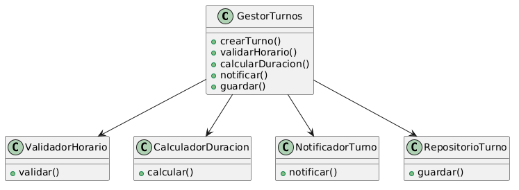

# Principio de Responsabilidad Única (SRP)

## ¿Qué es el Principio de Responsabilidad Única (SRP)?

El Principio de Responsabilidad Única (SRP, por sus siglas en inglés) establece que una clase debe tener una única razón para cambiar. En otras palabras, cada clase debe ser responsable de una sola funcionalidad o aspecto del sistema. Esto promueve un diseño más modular, facilita el mantenimiento y reduce el acoplamiento entre componentes.

Una clase viola SRP cuando maneja múltiples responsabilidades, lo que puede llevar a cambios frecuentes por razones diversas y aumentar la complejidad del código.

## Motivación

En el contexto del sistema de turnos médicos, aplicar SRP es crucial para mantener la claridad y la escalabilidad del software. Por ejemplo, consideremos clases que inicialmente concentran varias responsabilidades:

- **Clase `Turno`**: Originalmente, podría gestionar el estado del turno, validaciones de negocio, notificaciones y persistencia. Si cambia la lógica de validación, la clase entera se ve afectada, incluso si otras partes no necesitan modificarse.

- **Clase `Agenda`**: Podría manejar la disponibilidad de horarios, la asignación de turnos y el registro de cambios históricos. Un cambio en la lógica de horarios no debería impactar el registro de cambios.

Sin SRP, estas clases se vuelven difíciles de mantener, probar y reutilizar. Por ejemplo, si se modifica la forma de notificar a los pacientes, toda la clase `Turno` podría requerir cambios, aumentando el riesgo de introducir errores en otras funcionalidades.

## Identificación de Clases con Múltiples Responsabilidades

En el diseño inicial del sistema, se identificaron las siguientes clases con violaciones a SRP:

- **`Turno`**: Responsable de gestionar el estado del turno, validar reglas de negocio, enviar notificaciones y persistir datos. Esto viola SRP porque combina lógica de dominio, validación y comunicación.

- **`Agenda`**: Maneja la disponibilidad de horarios, asigna turnos a médicos, registra cambios en el historial y calcula estadísticas. Incluye responsabilidades de gestión de datos, lógica de negocio y reporting.

- **`Secretaria`**: Podría estar encargada de gestionar turnos, validar disponibilidad, notificar pacientes y administrar usuarios. Combina operaciones administrativas con comunicación y validación.

Estas clases tienen múltiples razones para cambiar: cambios en reglas de negocio, modificaciones en notificaciones, actualizaciones en persistencia, etc.

## Propuesta de Refactorización

Para adherirnos a SRP, proponemos separar las responsabilidades en clases más especializadas:

- **`Turno`**: Solo gestiona el estado y propiedades del turno (fecha, hora, paciente, médico). No incluye lógica de validación ni notificaciones.

- **`ValidadorTurno`**: Responsable de validar reglas de negocio relacionadas con turnos, como disponibilidad de horarios y conflictos.

- **`NotificadorTurno`**: Maneja el envío de notificaciones a pacientes y médicos (emails, SMS, etc.).

- **`Agenda`**: Gestiona la disponibilidad de horarios y asignación básica de turnos.

- **`HistorialCambios`**: Registra y consulta el historial de modificaciones en turnos y agendas.

- **`GestorSecretaria`**: Coordina operaciones administrativas, delegando validaciones y notificaciones a las clases especializadas.

Esta separación permite que cada clase cambie por una sola razón, facilitando pruebas unitarias, reutilización y mantenimiento.

## Estructura de Clases

El siguiente diagrama muestra la separación de responsabilidades aplicada según el principio SRP.

