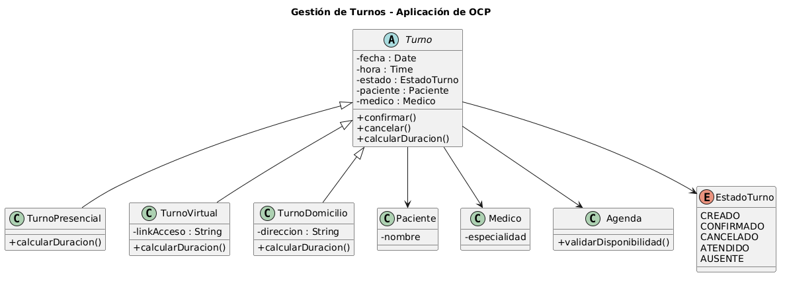

# Principio Abierto/Cerrado (OCP)

## Propósito y Tipo del Principio SOLID

El principio Abierto/Cerrado (OCP) establece que las entidades de software (clases, módulos, funciones) deben estar **abiertas para su extensión**, pero **cerradas para su modificación**. Esto permite agregar nuevo comportamiento sin alterar el código existente que ya funciona.

## Motivación

En el sistema de turnos médicos, originalmente la clase `Turno` contenía lógica condicional (if/switch) para determinar acciones según el tipo de consulta (general, especialista, urgencia). Cada vez que se quería agregar un nuevo tipo de consulta, había que modificar la clase `Turno`, violando OCP y aumentando el riesgo de introducir errores en funcionalidades ya probadas.

Aplicando OCP, creamos una abstracción `TipoConsulta` y movermos los comportamientos específicos a subclases (`ConsultaGeneral`, `ConsultaEspecialista`, `ConsultaUrgencia`). De esta forma, el sistema puede extenderse con nuevos tipos de consulta sin modificar la clase `Turno` ni las clases existentes.

## Explicación de Herencia

La herencia es un mecanismo de la programación orientada a objetos que permite que una clase (subclase) herede atributos y métodos de otra clase (superclase). Para cumplir con OCP, utilizamos una **clase abstracta** o **interfaz** como contrato base, y las subclases concretas implementan comportamientos específicos. La clase que usa estas abstracciones (como `Turno`) depende de la abstracción, no de las implementaciones concretas, permitiendo agregar nuevas subclases sin modificar el código cliente.

## Estructura de Clases

## Justificación Técnica

En el diagrama se observa que la clase `Turno` mantiene una referencia a la abstracción `TipoConsulta` (una interfaz o clase abstracta). Las clases concretas `ConsultaGeneral`, `ConsultaEspecialista` y `ConsultaUrgencia` implementan esta abstracción, cada una con su propia lógica de duración, preparación o prioridad. De esta manera, `Turno` no necesita saber qué tipo concreto de consulta está manejando; solo invoca los métodos definidos en la abstracción. Si en el futuro se requiere un nuevo tipo de consulta (ej. `ConsultaTelemedicina`), basta con crear una nueva subclase sin tocar `Turno` ni las otras consultas, cumpliendo con OCP.