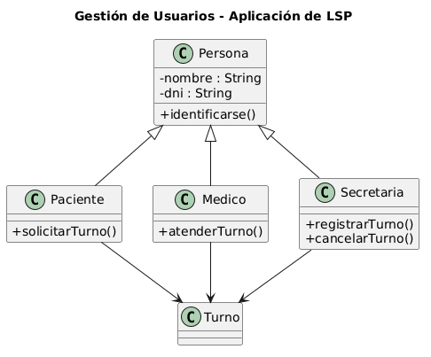

# Principio de Sustitución de Liskov (LSP)

## Propósito y Tipo del Principio SOLID

El principio de Sustitución de Liskov (LSP) establece que si S es un subtipo de T, entonces los objetos de tipo T pueden ser reemplazados por objetos de tipo S sin alterar el comportamiento correcto del programa. En otras palabras, las subclases deben poder sustituir a sus superclases sin que el sistema falle o se comporte de manera inesperada.

## Motivación

En el sistema de turnos médicos, inicialmente se planteó una jerarquía donde `Persona` era la superclase, y `Paciente` y `Medico` eran subclases. Sin embargo, surgió un problema: se asignaron responsabilidades a `Paciente` (como `asignarTurno()`) que no tenían sentido para `Medico`, y viceversa (método `recetar()` en `Medico` que no aplicaba a `Paciente`). Esto violaba LSP porque una instancia de `Paciente` no podía reemplazar a `Persona` sin romper el comportamiento esperado.

La solución fue rediseñar la jerarquía: `Persona` solo contiene atributos comunes (nombre, DNI, contacto). Los comportamientos específicos se mueven a interfaces segregadas (`IPuedeAsignarTurno`, `IPuedeRecetar`). Las subclases implementan solo las interfaces que necesitan, garantizando que cualquier instancia de `Paciente` puede reemplazar a `Persona` sin problemas.

## Explicación de Herencia

La herencia permite que una subclase herede y extienda el comportamiento de una superclase. Para respetar LSP, la subclase no debe:
- Reforzar precondiciones
- Debilitar poscondiciones
- Lanzar excepciones nuevas que la superclase no lance
- Modificar el estado de manera que el supertipo no espere

En nuestro diseño, `Paciente` y `Medico` heredan solo atributos y métodos comunes de `Persona` (getters, setters básicos). Cualquier comportamiento adicional se define en interfaces separadas, garantizando que la sustitución sea segura.

## Estructura de Clases

## Justificación Técnica

En el diagrama se observa que `Persona` es una clase base con atributos comunes. `Paciente` y `Medico` heredan de `Persona` sin sobrescribir métodos de manera conflictiva. Además, se aplica el principio de segregación de interfaces (ISP) en conjunto: `Paciente` implementa `IPuedeAsignarTurno` y `IPuedeCancelarTurno`, mientras que `Medico` implementa `IPuedeRecetar` y `IPuedeVerAgenda`. Cualquier función que reciba un parámetro de tipo `Persona` puede recibir tanto un `Paciente` como un `Medico` sin romper el comportamiento esperado, cumpliendo así con LSP.