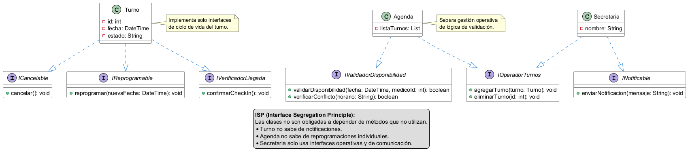

# Principio de Segregación de Interfaces (ISP)

### Propósito y Tipo del Principio SOLID
El Principio de Segregación de Interfaces (Interface Segregation Principle) es uno de los principios de SOLID, y básicamente dice algo así: “No obligues a una clase a implementar cosas que no necesita”. O sea, en vez de tener una interfaz gigante con mil métodos, es mejor tener varias interfaces más chiquitas y específicas.

### Proposito, Motivación
Al analizar el diseño del Sistema de Turnos Médicos, encontramos clases que estan haciendo demasiadas cosas a la vez. Por ejemplo, la clase `Turno` tiene metodos como "reservar()", "cancelar()", "reprogramar()", "confirmarCheckIn()", la cual mezcla responsibilidades distintas, `Agenda` tiene metodos como "agregarTurno()", "eliminarTurno()", "verificarConflicto()", "validarDisponibilidad()", "mostrarAgendaDiaria()", lo cual está haciendo de todo, gestion de turnos, validaciones y visualización. Lo mismo con `Secretaria`. Entonces el ISP solucionaria esto, la idea es dividir todo en interfaces más especificas, por ejemplo: "ICancelable", "IReprogramable", "INotificable", "IGestorTurnos", "IValidadorDisponiblidad". Entonces quedaría como:

- Turno: ICancelable, IReprogramable
- Secretaria: IGestorTurnos, INotificable
- Agenda: IGestorTurnos, IValidadorDisponibilidad

Por lo tanto al separar las responsabilidades cada interfaz representa una unica responsabilidad clara:
- Cancelar turnos → Una interfaz
- Reprogramar → Otra interfaz
- Notificar → Otra interfaz

Esto hace que ahora cada modulo dependa solo de lo que usa y al tener interfaces más chicas podes testear cada cosa por separado.

### Explicación de Interfaces
En la Programación Orientada a Objetos, una interfaz es un contrato abstracto que define un conjunto de comportamientos (métodos) que una clase concreta se compromete a implementar. Aplicar el ISP significa que estas interfaces deben estar diseñadas desde la perspectiva del cliente que las va a usar; deben ser "contratos" específicos para un dominio acotado para asegurar que las clases que las implementan usen el 100% de los métodos definidos.

### Estructura de Clases
A continuación se presenta el diagrama de clases modelado con PlantUML aplicando ISP:

### Justificación Técnica
Elegí aplicar ISP porque, al revisar el diseño inicial, noté que clases como `Turno`, `Secretaria` y `Agenda` estaban "haciendo de todo". Eran clases muy pesadas que mezclaban tareas que no tenían mucho que ver entre sí, el problema que encontré:

La clase Turno era un lío: se encargaba de la reserva, de las cancelaciones y hasta de avisar cuando el paciente llegaba al consultorio. Si un programador quería cambiar algo de las cancelaciones, corría el riesgo de romper la parte de las citas porque estaba todo pegado.

Con la Agenda pasaba algo parecido: mezclaba el guardado de los turnos con las reglas para validar si un médico estaba disponible.

Cómo lo solucioné:
Dividí esas responsabilidades grandes en interfaces chiquitas y específicas: ICancelable, IReprogramable, IValidadorDisponiblidad, entre otras.

Ahora está mucho mas limpio ya que si quiero cambiar cómo se notifican los turnos, solo toco la interfaz INotificable. No hace falta tocar nada de la `Agenda` ni del `Turno`. La clase `Secretaria` o `Agenda` ya no están obligadas a saber hacer cosas que no les corresponden. Solo usan la "parte" del código que necesitan en ese momento. Si el día de mañana el consultorio quiere agregar nuevas reglas, es mucho más fácil de implementar sin desordenar lo que ya funciona.