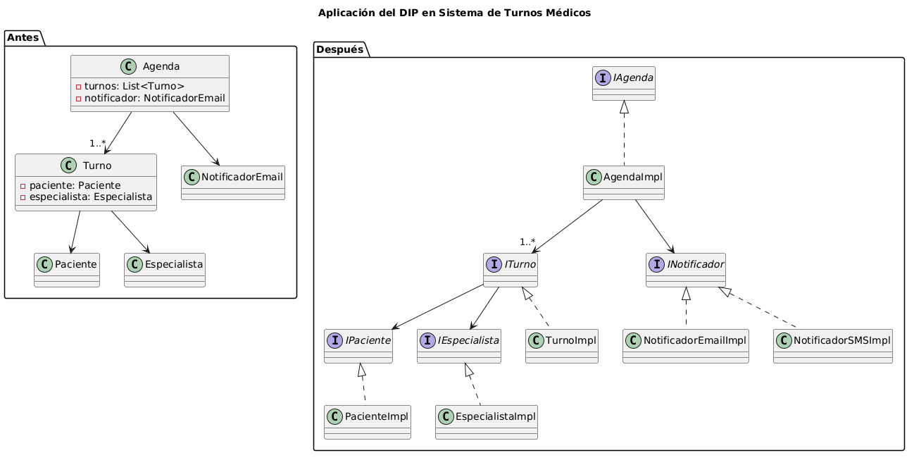

# Principio de Inversión de Dependencias (DIP)

## 1. Qué es una clase abstracta
Una clase abstracta es un tipo especial de clase en la programación orientada a objetos que no puede ser instanciada directamente, es decir, no se pueden crear objetos de ella. Su propósito es servir como modelo base para otras clases, que deberán derivar (heredar) de ella.
Una clase abstracta puede contener:

Métodos abstractos: métodos declarados pero sin implementación, que cada subclase concreta debe implementar obligatoriamente.
Métodos con implementación: métodos que ya tienen un comportamiento definido y que pueden ser reutilizados o sobreescritos por subclases.
Las clases abstractas se utilizan para definir un contrato parcial común y compartir lógica entre diferentes implementaciones concretas, permitiendo organizar y reutilizar código en jerarquías de clases relacionadas.

## 2. Qué es una interfaz
Una interfaz (o “interface”) es un contrato en la programación orientada a objetos que define un conjunto de métodos que una o varias clases deben implementar, pero no provee ninguna implementación de esos métodos. Las interfaces permiten describir qué operaciones debe ofrecer un objeto, sin especificar cómo se realizan.

A diferencia de las clases abstractas, las interfaces no contienen atributos ni lógica interna (al menos en los lenguajes clásicos como Java anteriormente, aunque hoy pueden tener métodos default). Las clases que implementan una interfaz se comprometen a ofrecer el comportamiento declarado en la interfaz, permitiendo así programar contra abstracciones y no contra implementaciones concretas.

El uso de interfaces favorece el bajo acoplamiento, facilita los cambios y las pruebas, y permite la interoperabilidad entre clases no relacionadas que cumplen con el mismo contrato.

## 3. Análisis de dependencias actuales
Al analizar el diseño actual del sistema de turnos médicos (basándonos en los documentos anexos/introduccion.md, diagramas/01-diagrama-clases/01-boceto-inicial.excalidraw y las tarjetas CRC en herramientas-agile/tarjetas-crc/), se detectaron los siguientes puntos:

Turno:
Posee referencias directas a Paciente y Especialista. Para el funcionamiento del sistema, un objeto Turno necesita enlazar y utilizar datos/funcionalidad específicos de ambas clases.

Agenda:
Gestiona directamente una colección/array/lista de Turno y manipula objetos Turno de forma concreta (alta, baja y modificación).

ControladorTurnos (o equivalente):
Crea instancias de Turno, Paciente y Especialista de forma directa (usando new, sin pasar por una fábrica ni por una abstracción/interfaz).

Notificaciones:
Si existe una funcionalidad de notificación, el sistema usa una implementación concreta, por ejemplo NotificadorEmail, directamente en vez de emplear una interfaz o clase abstracta. Esto impide reemplazar el mecanismo de notificación fácilmente.

## 4. Identificación de acoplamientos hacia clases concretas

Al analizar las dependencias detectadas, se identifican los siguientes acoplamientos problemáticos hacia clases concretas en el sistema:

- **Turno → Paciente y Turno → Especialista**  
  La clase Turno mantiene referencias directas a las implementaciones concretas de Paciente y Especialista, acoplándose firmemente a sus detalles y dificultando la extensión (por ejemplo, nuevas subclases o cambios en la lógica de estos actores).

- **Agenda → Turno**  
  Agenda opera exclusivamente sobre colecciones de objetos Turno concretos, impidiendo el uso de otras posibles implementaciones de un turno (TurnoTelemedicina, TurnoUrgente, etc.).

- **ControladorTurnos → Paciente, Especialista, Turno**  
  El controlador instancia (usa new) y opera con las clases concretas Paciente, Especialista y Turno, dificultando separar la lógica de orquestación de la lógica de dominio. Esto afecta la capacidad para adaptarse a cambios o incorporar nuevos tipos de actores sin modificar el controlador.

- **NotificadorEmail**  
  Si existe una clase que comunica novedades a los usuarios (como NotificadorEmail), esta es utilizada de forma directa, en vez de recurrir a una abstracción (como una interfaz INotificador). Esto implica que si se desea incorporar, por ejemplo, notificaciones por SMS o WhatsApp, habría que modificar todas las clases que usan NotificadorEmail.

### Conclusión

Estos acoplamientos a clases concretas hacen que el sistema de turnos sea menos flexible, más costoso de mantener y difícil de testear o extender. La solución es abstraer estos puntos mediante interfaces o clases abstractas e introducir inyección de dependencias.

## 5. Propuesta de abstracciones para invertir dependencias

Para eliminar el acoplamiento a clases concretas y cumplir con el Principio de Inversión de Dependencias (DIP), se proponen las siguientes abstracciones específicas al dominio:

- **ITurno**  
  Interfaz que representa el contrato para la gestión de un turno. Permitiría que Turno, TurnoTelemedicina, TurnoUrgente, etc., implementen el mismo conjunto de operaciones básicas (agendar, cancelar, obtener información).

- **IEspecialista**  
  Interfaz o clase abstracta que representa cualquier actor del sistema que brinde servicios médicos. De esta forma, el sistema puede utilizar distintas especializaciones (especialista presencial, especialista virtual, etc.) sin depender de una sola implementación.

- **IPaciente**  
  Interfaz para los datos/comportamiento general de pacientes, permitiendo que distintas versiones o tipos de pacientes puedan coexistir en el sistema y ser manejadas de forma polimórfica.

- **IAgenda**  
  Interfaz para la entidad que agrupa y organiza turnos. Así, el controlador y otros componentes pueden interactuar con cualquier implementación de agenda (diaria, mensual, virtual, compartida) sin depender de una estructura concreta.

- **INotificador**  
  Interfaz para el mecanismo de notificación. Así se desacopla el proceso de notificación de la tecnología específica (correo, SMS, WhatsApp).

### Ejemplo de definición de interfaces:

## 6. Diseño de inyección de dependencias

Para aprovechar las abstracciones propuestas y desacoplar las clases concretas, se aplica la inyección de dependencias.

La inyección de dependencias consiste en ofrecer a cada clase las instancias de sus dependencias desde fuera, en vez de instanciarlas directamente. De esta forma, la clase depende solo de una interfaz o clase abstracta.

Antes (acoplamiento fuerte):

Después (usando inyección de dependencias con interfaces):

Del mismo modo, podemos aplicar el patrón al resto de clases:

## 7. Diagrama de Clases con DIP aplicado

A continuación se compara el diseño original (dependencias hacia clases concretas) con el diseño mejorado según el Principio de Inversión de Dependencias (DIP).

Ver archivos fuente:
- [Diagrama .puml](../../diagramas/01-diagrama-clases/01-solid-05-dip.puml)
- [Imagen .png](../../diagramas/01-diagrama-clases/01-solid-05-dip.png)
